`Lesson 02` Product Strategy
================
Anderson Uyekita

-   Title: Role of a Product Manager
-   Course: Product Manager Nanodegree
    -   COD: ND036
    -   Instructor: Alex King
    -   Start: Tuesday, 25 March 2022
    -   Finish: Wednesday, 29 March 2022

------------------------------------------------------------------------

## Class Notation

### 1. Lesson Intro

> In this lesson, we’ll cover the following topics:
>
> -   The Role of a PM
> -   What a PM Does
> -   Who PMs work with
> -   Identifying Requirements
> -   The Roadmap & PRD

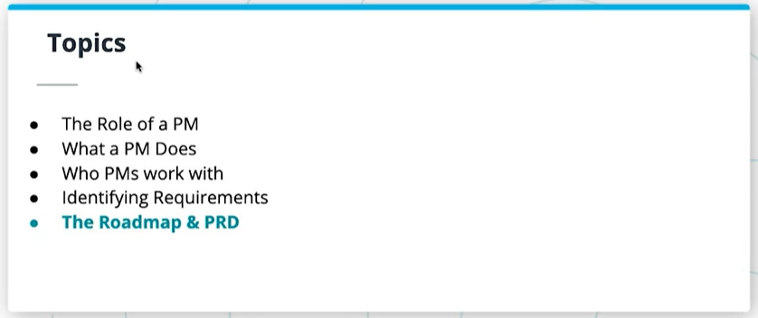

> At the end of this lesson, you’ll be able to:
>
> -   Understand the purpose of the PM role
> -   Understand what a PM does during the different stages of the
>     Product Development Cycle
> -   Identify key cross-functional partners and customize
>     communications based on understanding of their key priorities
> -   Describe different methods for gathering requirements
> -   Define the components of a PRD and how to complete each component
>     including documenting requirements

### 2. The Role of a the Product Manager

The PM is well known to be the person in charge of leading the team to
solve the problem successfully (building products that people want), but
there is some variability. Figure 1 presents where the PM is positioned
(in the center of Design, Business, and Technology).

The PM needs to have a background in all those three dimensions to be
successful. Figure 2 shows the roles of a PM.

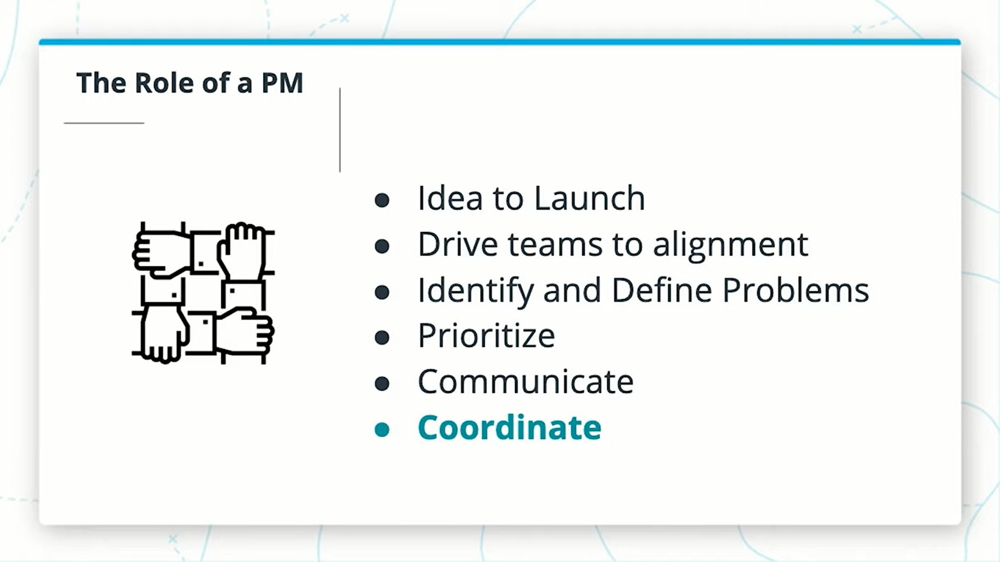

##### i. Idea to Launch

> The PM often acts as many CEOs as they are responsible for the
> outcomes of their products.

##### ii. Drive teams to alignment

The PM does not impose or force any conditions on the team. Instead, the
PM persuades the team. Also, the PM does not have hierarchical privilege
over the team building the product.

The critical activity of the PM is to guide the team to build what
should be created according to the users’ needs.

##### iii. Identify and Define problems

Solving problems can:

-   Make product more appealing to users;
-   Increase sales;
-   Reduce churn;
-   Stay competitive in the market;
-   Increase your team efficiency, and;
-   Be required for legal compliance.

##### iv. Prioritize

Using a stack ranked list can be helpful (backlog) because it is much
clearer to know the sequence.

##### v. Communicate

The PM is the person in charge of answering almost any product question
or knowing precisely where to get the answer.

##### vi. Coordinate

The PM is responsible for coordinating the product’s development across
all stakeholders (Design, DevOps, Engineer, Marketing, Executive,
Support, etc.).

In addition, the PM should understand all requirements to build the
product, dispatching the activities to the right people at the right
time.

#### Differences in Product Management

Figure 3 shows two different types of PMs.

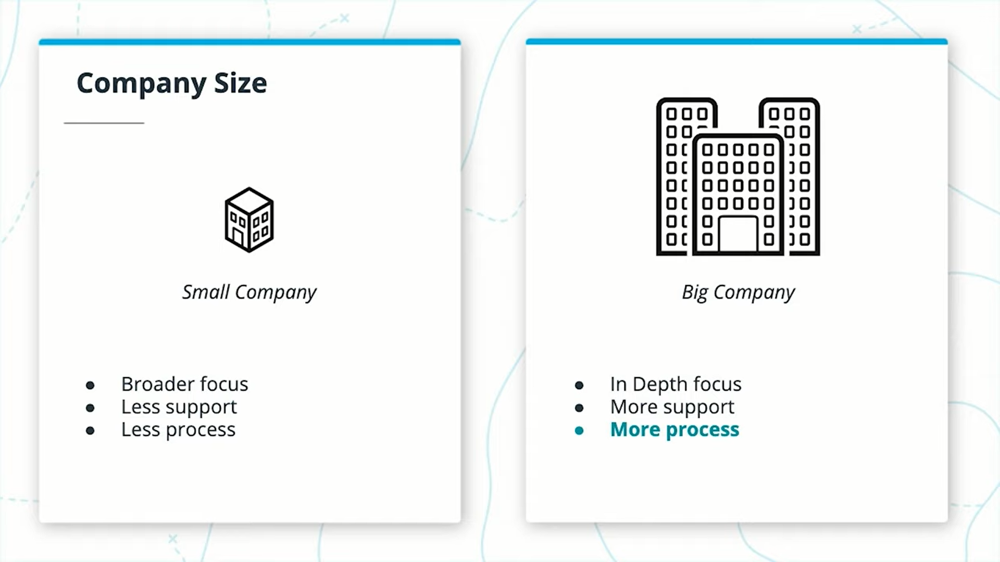

The PM’s responsibility could vary significantly according to the
company size and the product. For example, it’s more likely that PMs
will have more end-to-end responsibility at smaller companies and wear
more hats. On the other hand, larger companies will often allow PMs to
maintain a narrow focus and go super deep into that area.

It is super important to be in touch with other PMs in large companies
to understand:

-   Their roadmaps;
-   Shared problems and be able to solve them together, and;
-   Or dependencies that you have on the other teams.

#### Product Philosophy

> A company’s philosophy of building products also shapes the role of a
> PM. The most common philosophies are:
>
> 1.  Product led
> 2.  Engineering led
> 3.  Product + Eng partnership (hybrid)

##### 1. Product led

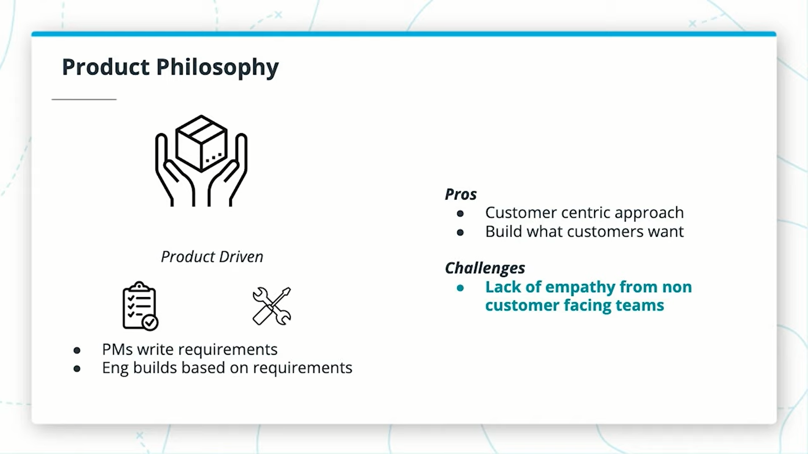

EXAMPLE: Amazon Prime - easy, fast and convenient

##### 2. Engineering led

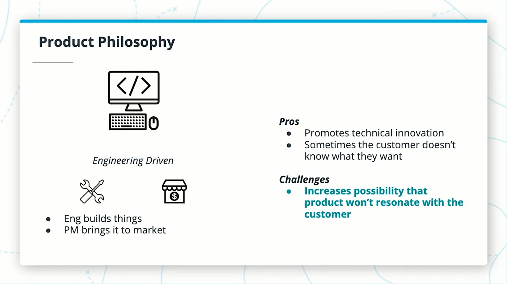

EXAMPLE: Google Glass - Amazing technology but not solving a problem

##### 3. Product + Eng partnership (hybrid)

#### Type of User

According to the audience of the products, the PM should focus on
different aspects of the development. Figure 7 presents a simple resume
of it.

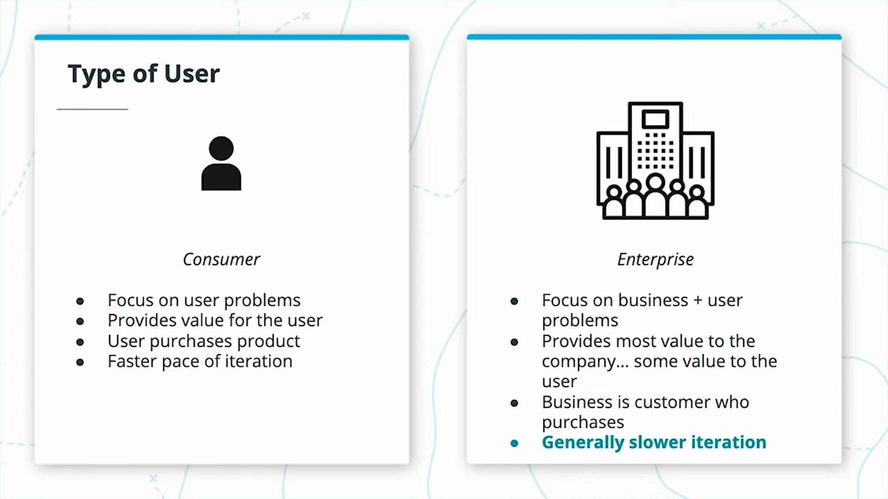

The PMs can also specialize in different types of product, such as:

-   Data
-   Growth
-   Hardware
-   Internationalization
-   Software

#### References

-   [What To Expect as a PM from Startup to Scale Up, to
    Corporates](https://productcoalition.com/what-to-expect-as-a-pm-from-startup-to-scale-up-to-corporates-part-1-of-3-e7478117dd2b)
-   [What It Takes to Become a Great Product
    Manager](https://hbr.org/2017/12/what-it-takes-to-become-a-great-product-manager)
-   [Product Managers for the Digital
    World](https://www.mckinsey.com/industries/technology-media-and-telecommunications/our-insights/product-managers-for-the-digital-world)

### 3. What a PM does?

The PM has a lot of activities, and it depends on the development
journey of the product.

1.  Identifying problems: It is the core of the PM activities;

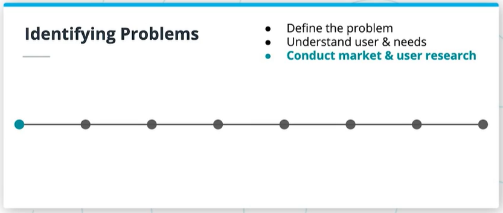

2.  Creating solutions: The PM will build strategies for how to solve
    the problem;

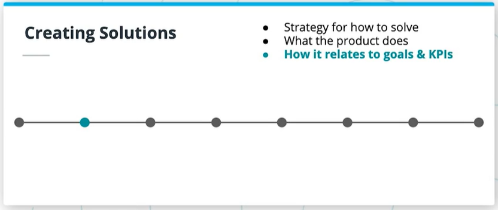

3.  Planning: How to split the product into smaller deliverables;

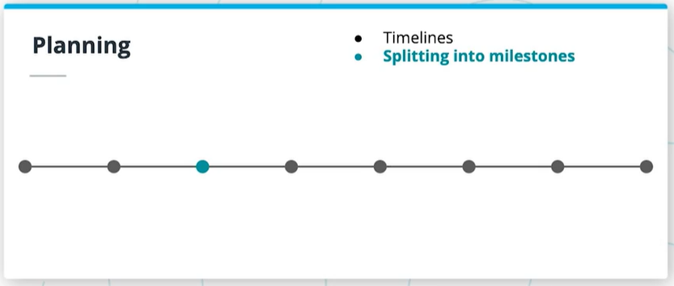

4.  UX design: Building mocks, reviewing the mock, running usability
    tests;

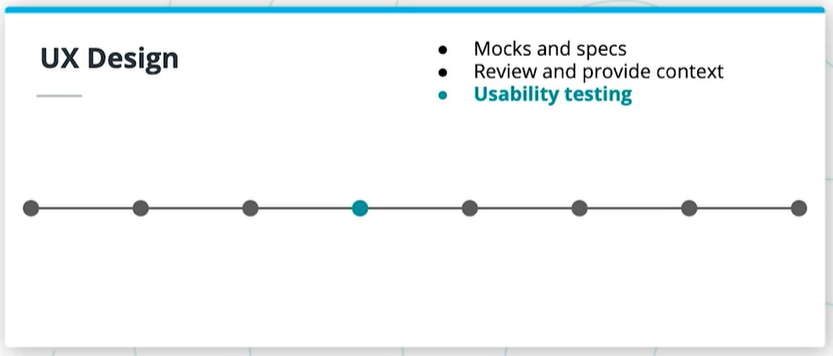

5.  Implementation: Following the development progress, answering any
    doubts about the requirements;

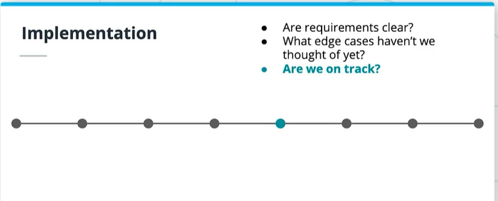

6.  Testing: How should it work? What do we need to fix?;

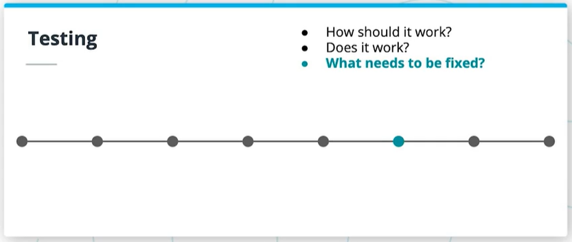

7.  Launch: How to roll out? Minor patches?;

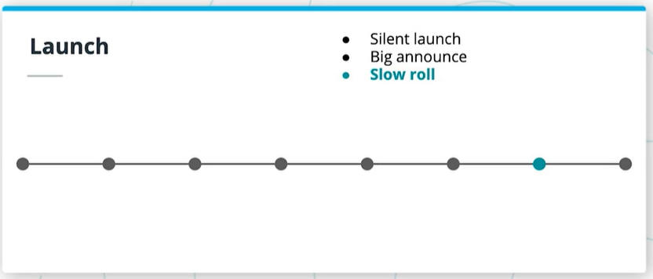

8.  Review: Lesson learned.

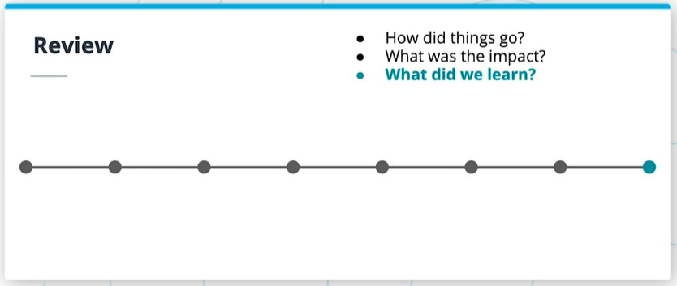

PMs do a variety of things in order to help the team figure out what
product to build and get it out the door:

-   Act as mini CEOs for the product from idea to launch
-   Drive teams to alignment
-   Identify and define problems
-   Prioritize what the team is focusing on
-   Act as a spokesperson for the product
-   Coordinate the development of their product across all teams

> -   **Finding the problem** (Understand, Identify, Define): This is
>     part of the core PM and is one of the most important things that a
>     PM does. PMs spend a lot of time defining the problem for the team
>     to solve.

> -   **Creating strategy**: Once armed with an understanding of the
>     problem space and opportunity, PMs can build strategies for how to
>     solve the problem through the creation of their product.

What PM need to do **all the time**:

-   Communicating
-   Coordinating
-   Remove blockers
-   Make sure things get done
-   Keep the team happy all the time.

More things that Product Managers do:

> **Communicating**: The best PMs ensure that the entire team is on the
> same page. This can be accomplished through a variety of different
> mediums like presentations and conversations.

> **Coordinating development and launch**: PMs are also responsible for
> coordinating the development and launch of their product across all
> the various cross functional partners involved (design, engineering,
> marketing, legal, support, etc). This doesn’t mean PMs do all the
> work; they facilitate conversations and help to remove blockers or
> things that might be slowing the team down. They also make sure that
> everything that needs to happen does actually happen.

> **Responding to new information**: Things change all the time. PMs
> need to stay up to date with the latest information. Whether that’s
> from new insights from user research, results from an experiment,
> feedback from the support team, new product launch from a competitor.

> **Responding to fires**: PMs need to be able to juggle multiple tasks
> and quickly switch focus when priorities change, (i.e. there is an
> outage).

All PMs write PRDs to frame the problem and document requirements for
the solution.

> **IMPORTANT:** You can test the effectiveness of your communication by
> asking people on the team “What are we building and why?” If you ask 5
> people that question and get the same answer back from everyone the PM
> is doing a good job. If you ask 5 people and get 6 different answers
> back, the PM has more work to do

### 4. Who PM’s work with?

The PM works with EVERYONE. They interact with all stakeholders
throughout the product development cycle. They act like a hub to connect
all different parts and teams related to the product.

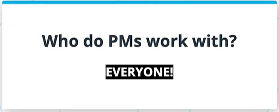

-   Research
    -   Role: Help to answer essential questions, discover new key user
        insights, and get feedback from usability tests.
    -   Interactions: Share research findings, participate in field
        research, etc.

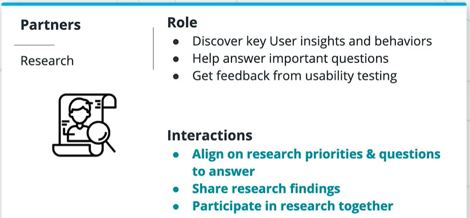

-   Design
    -   Role: Design how the product looks, how the user will
        use/interact with the product, guarantee we are solving the
        correct user’s problem.
    -   Interactions: Reviews mocks and PRDs, keeps track of the product
        scope and definition and manages the ideal design versus time
        and technical limitations.

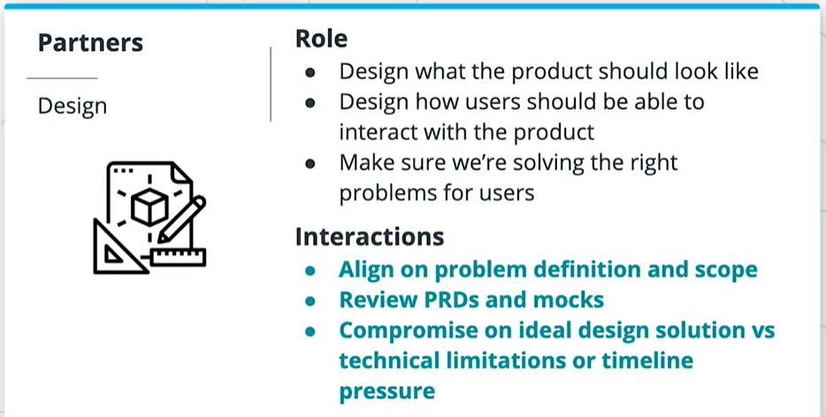

-   Engineering
    -   Role: Build the product, maintain the product, solve hard
        problems.
    -   Interactions: review requirement in PRDs, discuss feasibility
        and timelines, Tackle technical debts.

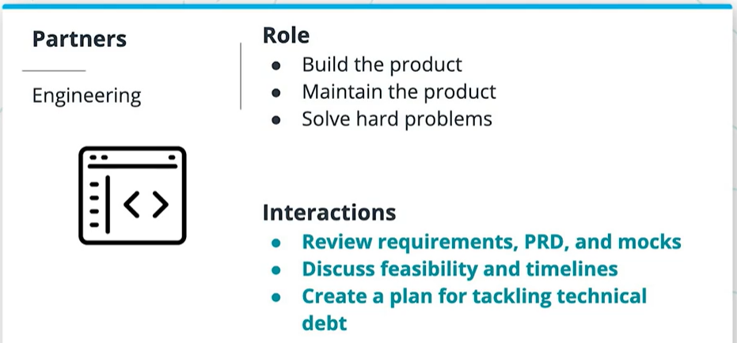

-   Technical Program Managers (TPM) and Program Managers (PgM)
    -   Role: Project Management, Report status of projects, Keep the
        team on schedule, and flag any risks and slips in schedule;
    -   Interactions: Go through piorization exercises, discuss
        timelines, and review roadmap.

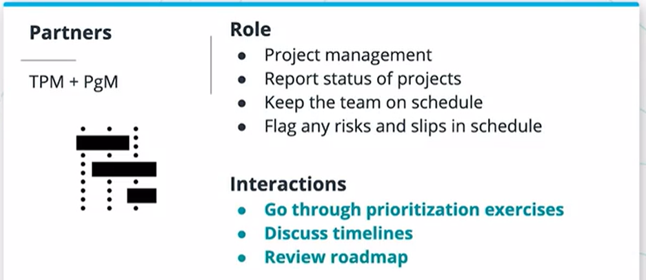

-   Difference between PM and PgM

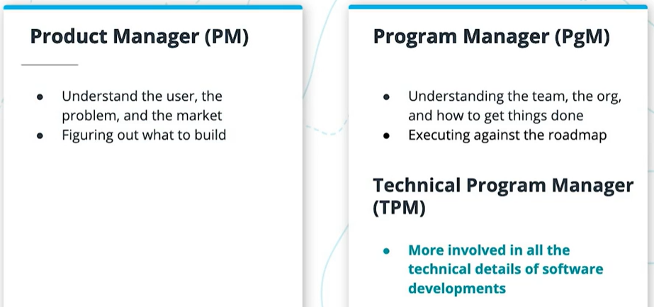

-   QA
    -   Role: Test the product to make sure everything works correctly,
        document bugs, and increase testing capabilities;
    -   Interactions: Review PRD, Review test plan and expected
        behaviors, and flag bugs and prioritize.

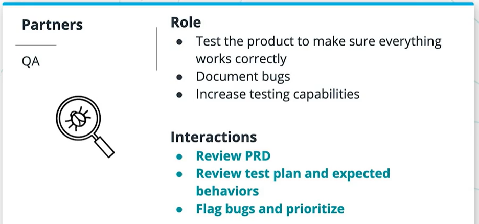

-   Data Science
    -   Role: Provide key insights based on data, design and roll out
        experiments, and quantify impact;
    -   Interactions: Align on Data Science priorities, review PRD, and
        review results from experiments.

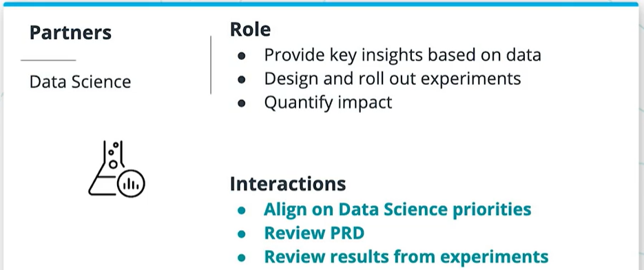

-   Marketing & PR
    -   Role: Explain what the product, lead user acquisition campaigns,
        manage web & social presence, make sure the right story lands,
        and organize press events;
    -   Interactions: Align on marketing priorities, discuss production
        positioning, review launch announcements and presentations,
        pre-briefing for interviews, help to support press review
        issues.

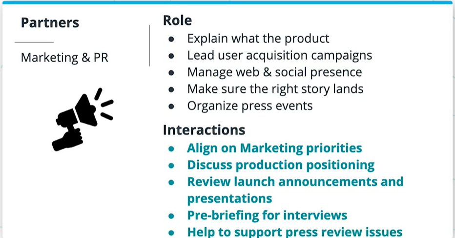

-   Sales
    -   Role: Sell the product, build relationship with customers, and
        insight into customer sentiment;
    -   Interactions: review roadmap and upcoming features, discuss
        feedback from customers and product shortcomings, and discuss
        features that would drive sales enablement.

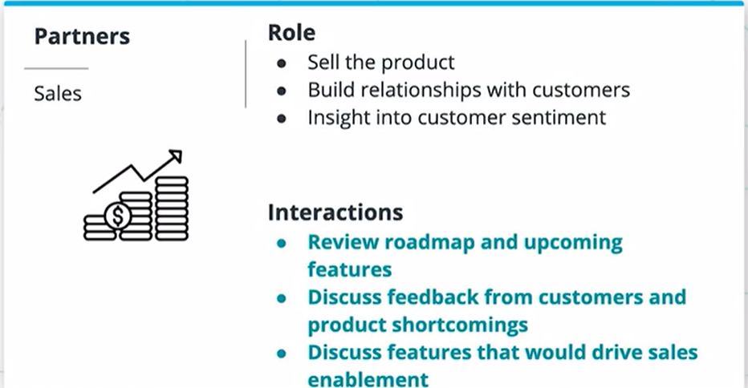

-   Support
    -   Role: Help users when they run into problems, track top issues
        users encounter, and improve support processes and tooling;
    -   Interactions: Review PRD and roadmap, discuss top customer
        issues, and discuss supportability.

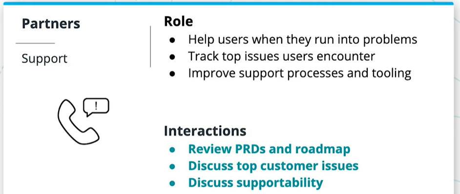

-   Legal & Privacy
    -   Role: Compliance with the law and privacy regulations, make sure
        data is being collected with purpose, stored appropriately, and
        deleted when no longer needed;
    -   Interactions: Review roadmap and PRDs, review flows and
        messaging, review data collection and storage, and discuss new
        legal & privacy requirements.

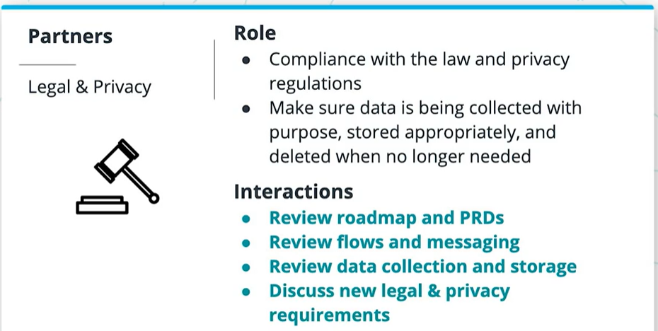

-   i18n
    -   Role: Adapt the product for other countries, translate the
        content in the product to other languages;
    -   Interactions: Review expansion plans and prioritize, and review
        any i18n bugs.

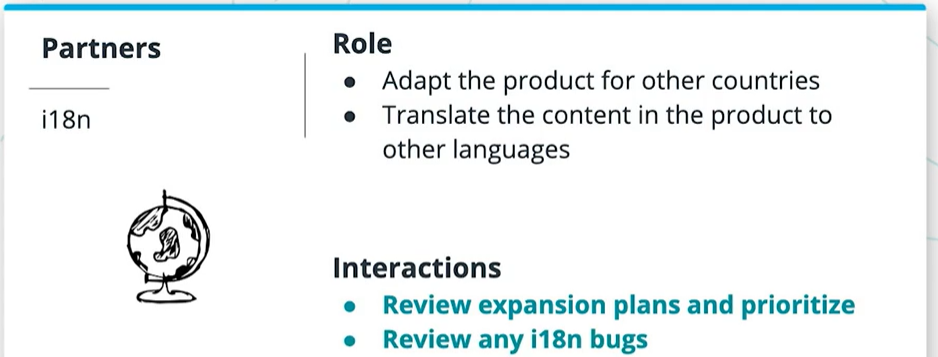

### 5. Exercise: New PM

Imagine that you have just started a job at a new company as a PM. How
would you want to structure your first weeks on the job?

Create a one page onboarding plan for starting as a PM at a new company.
Make sure to address the following

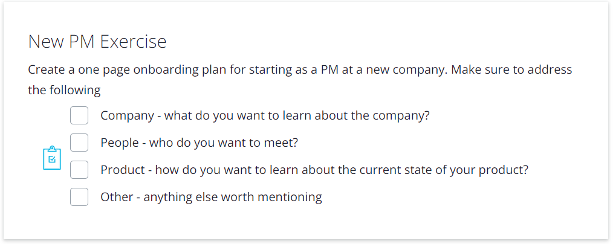

### 6. Solution: New PM

When you join a new team or company, it can take awhile to ramp up. To
get started on a good path, here are the things that I would try to do
during my first few weeks on a new team:

-   Company
    -   What the company does
    -   How the company makes money
    -   Short term goals and objectives
    -   Long term goals and objectives
    -   Current projects in flight

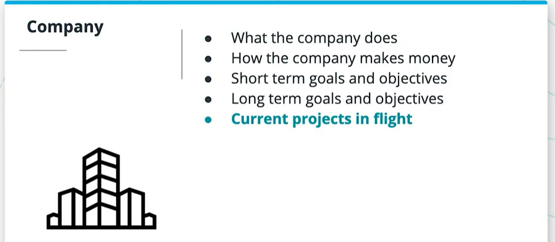

-   People
    -   My manager
    -   My manager’s manager
    -   Other PMs
    -   Design partner
    -   Research partner
    -   Eng partner
    -   TPM partner
    -   QA partner
    -   Data Science
    -   Marketing
    -   PR
    -   Sales
    -   Support
    -   Legal & Privacy
    -   Policy
    -   Ops
-   Product Experience
    -   Check out the product’s website
    -   Review the app store listing
    -   Use the product
    -   Journal of my experience using it
    -   Questions that I have about why it is the way it is
    -   List of issues that I encountered while using the product
    -   Get help for the product
    -   Review the support site
    -   Reach out to customer support for help with an issue
    -   Use competitor products
    -   Compare similarities and differences

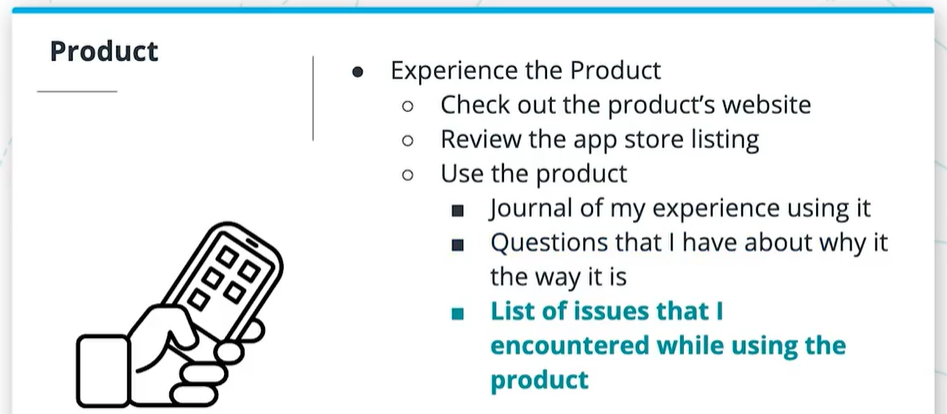

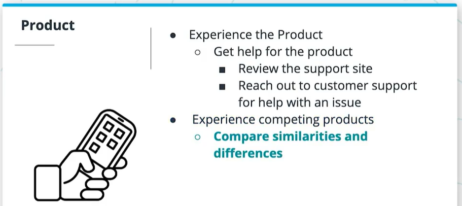

-   Other
    -   Process
    -   Learn the process for how to get things done
        -   What needs to be reviewed
        -   What requires approval
    -   Shadow support and listen to customer calls

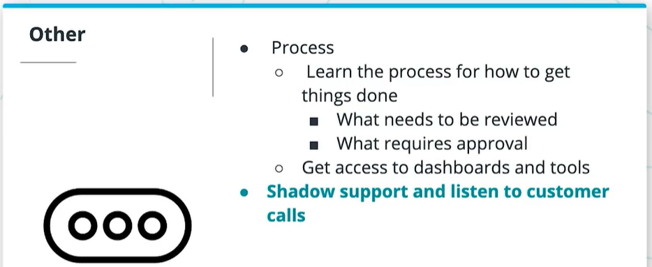

### 7. Identifying Requeriments

After defining the right problem, it’s time to start identifying the
requirements for the solution. The main questions is:

-   What should the product do and should not do?

This is also called **gathering requirements**. The PM needs to
understand the context behind each requirement. All requirements
identified must be documented in the PRD (a topic to be discussed in the
following video).

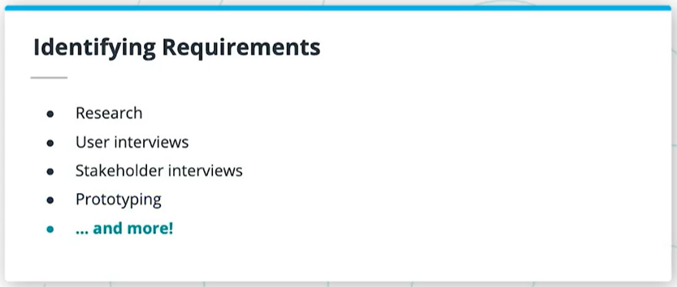

There are some channels to identify the requeriments:

|                             Method                              | Description                                                                                                                                                    |
|:---------------------------------------------------------------:|----------------------------------------------------------------------------------------------------------------------------------------------------------------|
|                            Research                             | It could be online research to understand better what will be developed and solved. It also could be used to validate some info already collected by the team. |
|        User interviews (*Input from users / customers*)         | Talks directly to the user to understand their needs. It is an excellent way to create empathy (you will be able to put the users’ shoes).                     |
| Stakeholder interviews (*Input from cross functional partners*) | Interview people from your company to understand their requirements to reach the business objectives.                                                          |
|                           Prototyping                           | Forces you to think about the solution (connect all the dots) so you can map out a lack of something critical to the product.                                  |

There are much more methods to get requirements.

Sometimes your audience might not be able to tell you what they need. In
other cases, they could be specific to nominate their needs, but it does
not mean that is the actual solution or requirement.

> The role of the PM is to **push deeper and understand the motivations
> and needs** that might not always be super apparent.

**Another tip:** You should document everything. It includes the steps
that you took to get to those requirements. Those notes it is not for
you but all for your team.

And two common challenges that come up when identifying requirements
are:

> 1.  Never be sure that all requirements have been identified.
>     Requeriments will continue to grow and evolve over time as you
>     learn more and get new informations.
> 2.  Users might not be able to tell you what the product should do
>     (ie: the requirement). Instead it’s better to focus on
>     understanding the problem the user is facing and their needs. Ask
>     why. Then ask why again. And keep asking why until you get to a
>     deeper understanding.

Keep the PRD up-to-date and record all modifications in a changelog as
the requirements change.

#### References

-   [Effective requirements
    gathering](https://blog.buildo.io/effective-requirements-gathering-b9cbd8176075)
-   [Stop gathering
    requirements](https://www.goodproductmanager.com/2008/05/06/stop-gathering-requirements/)

### 8. The Roadmap & PRD

#### Roadmap

> A product roadmap is the plan that the team will be executing against.
> Product roadmaps provide a high level overview of the direction of the
> product over time. It calls out work that is required to meet business
> objectives and roughly when that work needs to happen.

The roadmap is a big picture of the product strategy over time and where
the product will be in the future. Also, it maintains the team’s
awareness of priorities and upcoming activities.

> Roadmaps are a powerful artifact because they set expectations across
> the team in terms of the team’s priorities. They also are a powerful
> mechanism for driving alignment across various stakeholders and making
> tradeoffs between new requests and planned work.

Creating a roadmap will keep the team updated about the product’s
evolution and enable the team to discuss if something is wrong in its
planning. In addition, the team could debate about prioritizing one
feature or reordering the sequence of development against schedule
impacts.

##### Tips of Creating Roadmaps

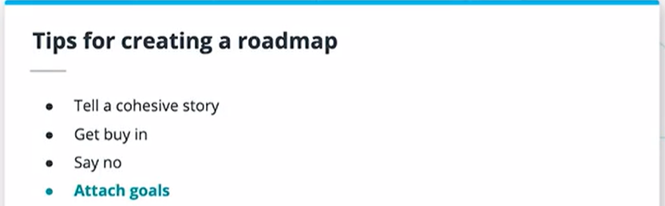

-   Tell a cohesive story: The roadmap work best when they **tell a
    story** about **what the team is going to build**, **how everything
    is related**, and **why this product is important**.
-   Get buy-in: Share it with your team and leadership to make everyone
    on the same page.
-   Say no: One of the PM’s most challenging chores is deciding what
    should not build.
-   Attach Goals: Define goals for each item in the roadmap. It will let
    you quantify and compare them.

> Innovation is not about saying YES to everything. It’s about saying NO
> to all but the most crucial features - Steve Jobs.

##### Roadmap Example

Figure 8 presents a roadmap example divided into three items.

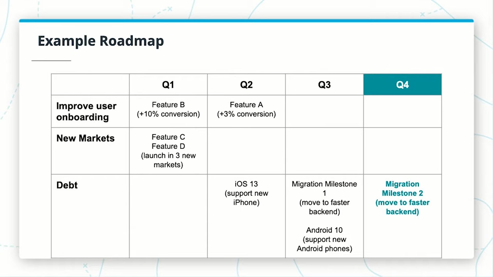

Bear in mind that each roadmap item needs to have its own PRD, which
will have details about the specific problem and requirements.

Figure 9 presents a roadmap example divided into teams.

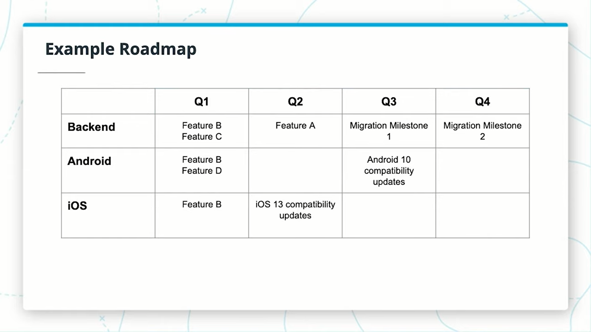

This kind of roadmap is helpful to define who is working on what and
find some space to fill with extra projects.

#### PRD

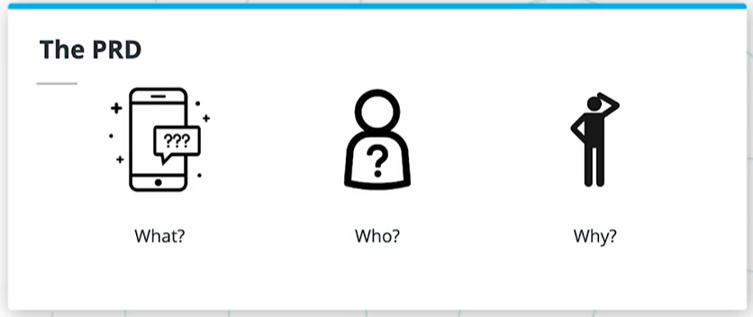

> The PRD is the source of truth that answers the question WHAT is the
> team building and WHY, which is incredibly helpful to drive alignment
> across the team. A PRD is never done and will continue to evolve as
> the team is working on the problem. It’s the PM’s job to write the PRD
> and keep it up to date as decisions are made and new information
> becomes available.

The PRD stands for Product Requirements Document, and it is the most
important artifact created by the PM. Because the PRD aligns the team
and makes sure that everyone is on the same page and solving the same
problem.

The PRD explains WHAT the product will solve, WHO will build it, and WHY
this product needs to be built. Also, the PRD needs to explain the right
tradeoff to make.

In addition, the PRD is a living document and will evolve continuously
according to the new information gathered or when any decisions are
made.

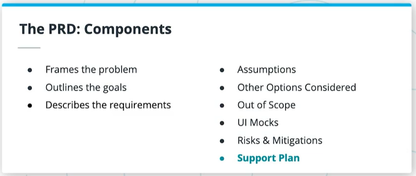

Figure 10 presents an example of PRD.

> PRDs always need to have these components:
>
> -   frame the problem… and answers the question WHY are we solving it.
> -   outline the goals… both user goals, business goals, and success
>     metrics. This section also helps to explain WHY the problem should
>     be solved.
> -   describe the requirements… WHAT does the product do? Remember, as
>     a PM you are answering WHAT the product does. Design and
>     engineering have to figure out HOW.

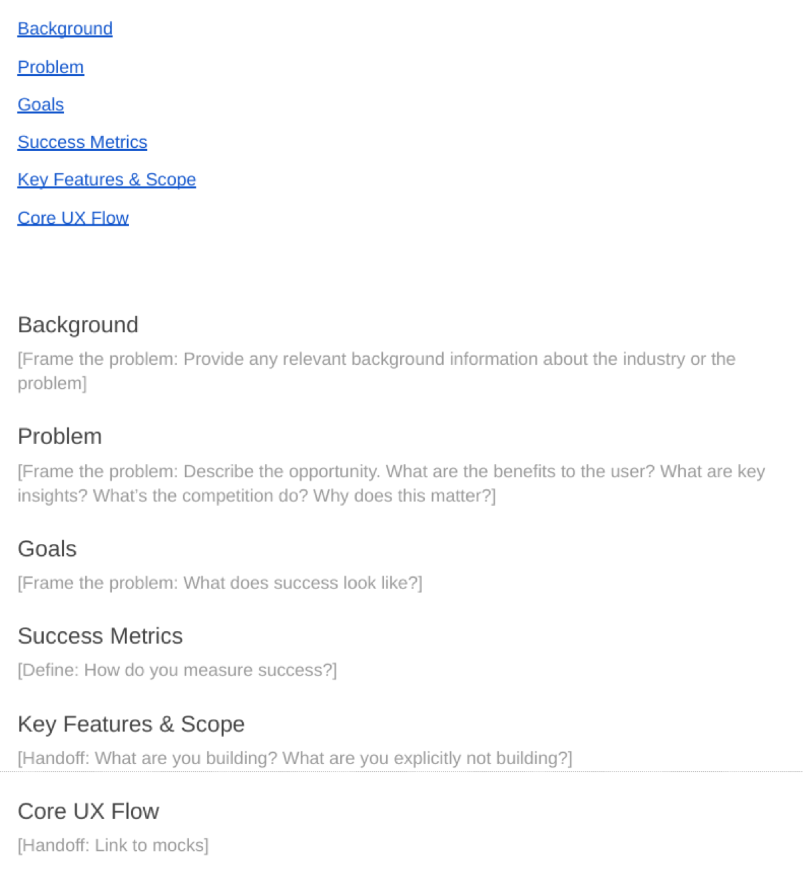

Additionally, other components can include:

-   Assumptions: Things you think are true, but you are not quite sure.
-   Out of scope: Features you explicitly decide not to include and your
    reason for it.
-   UI mocks: It can be super helpful to work with design and include
    these in the PRD because it is often easier to communicate some
    ideas visually instead of through text.
-   Risks & Mitigations: Pointing out the things that could go wrong and
    how to mitigate, prevent or minimize them.
-   Support Plan: What are the top issues users might run into, and how
    will we help them?

> Keep in mind that each roadmap item should have its PRD.

**Summary**

Product Managers spend a lot of their time answering the question WHAT
should the product do and aligning internal teams to execute against
their vision. There are two tools that PMs use to communicate WHAT the
product should do:

*Product Roadmap*:

-   High level overview of the direction of the product over time (ie:
    multiple features)
-   Rough timelines when work needs to happen
-   Set expectations across the team around prioritization.
-   Drive alignment across various stakeholders and help make tradeoffs
    between new requests and planned work.

*PRDs*:

-   More detail about a specific feature
-   Frame the problem and answer the question WHY are we solving it.
-   Outline the goals (both user goals, business goals, and success
    metrics). This section also helps to explain WHY the problem should
    be solved.
-   Describe the requirements and answers WHAT does the product do?
    Remember, as a PM you are answering WHAT the product does. Design
    and engineering have to figure out HOW.

Both Roadmaps and PRDs should evolve over time as the team is iterating
through problems and gets new information.

### 9. Exercise: Write a PRD

Imagine you are the PM working on an alarm clock app. Write a PRD for
the initial version

**Problem**

Frame the problem: Describe the opportunity. What are the benefits to
the user? What are key insights? What does the competition do? Why does
this matter?

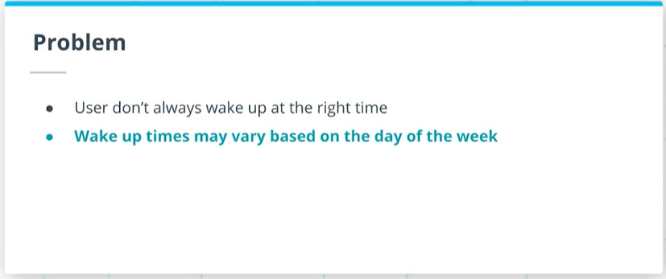

**Goals**

What are the product goals: What does success look like? How do you
measure success?

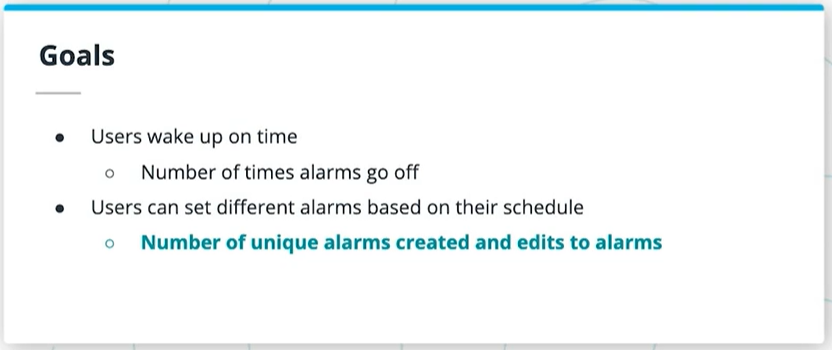

**Key feature requirements**

What should the product do? How should each feature be prioritized?

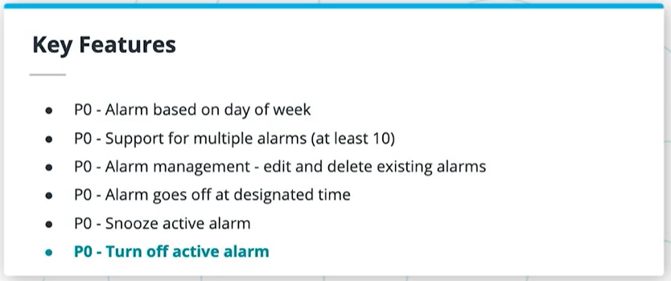

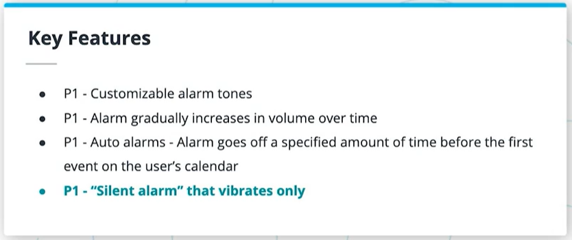 **Other**

Include any other components that you think could be helpful

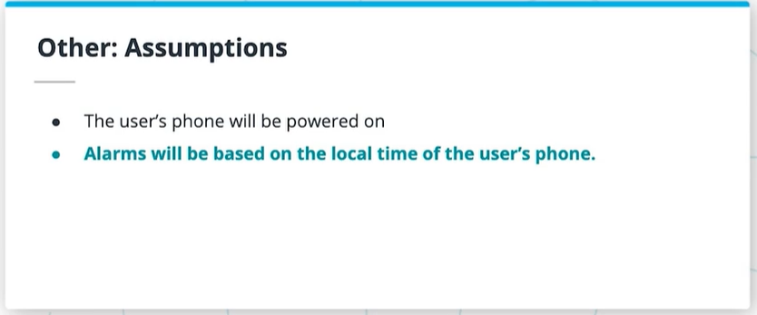

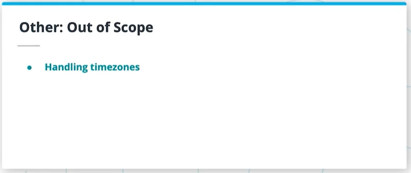

### 10. Solution: Write a PRD

> -   Problem
>     -   Users don’t always wake up at the right time
>     -   Wake up times may vary based on the time of day
> -   Goals
>     -   Users wake up on time
>     -   Users can set different alarms based on their schedule
> -   Key Features
>     -   P0 - Alarm based on day of week
>     -   P0 - Support for multiple alarms (at least 10)
>     -   P0 - Alarm management - edit and delete existing alarms
>     -   P0 - Alarm goes off at designated time
>     -   P0 - Snooze active alarm
>     -   P0 - Turn off active alarm
>     -   P1 - Customizable alarm tones
>     -   P1 - Alarm gradually increases in volume over time
>     -   P1 - Auto alarms - Alarm goes off a specified amount of time
>         before the first event on the user’s calendar
>     -   P1 - “Silent alarm” that vibrates only
>
> Keep in mind that this is just the very start of a PRD. As you work
> with the team to further define the product, each key feature should
> have much more detail about the specifics of what the feature does.

### 11. Exercise: Build a roadmap

Now that you’ve written a PRD for your alarm clock app, you need to
break the features out into a roadmap. Break out the roadmap into 4
quarters. Don’t worry too much about the specific sizing… Instead focus
on things that should be built together and what order those things
should be built in.

**Q1**

List out features on the roadmap that should be built in Q1. Make sure
to include your rationale for why these features should be built during
this timeframe.

**Q2**

List out features on the roadmap that should be built in Q2. Make sure
to include your rationale for why these features should be built during
this timeframe.

**Q3**

List out features on the roadmap that should be built in Q3. Make sure
to include your rationale for why these features should be built during
this timeframe.

**Q4**

List out features on the roadmap that should be built in Q4. Make sure
to include your rationale for why these features should be built during
this timeframe.

### 12. Solution: Build a roadmap

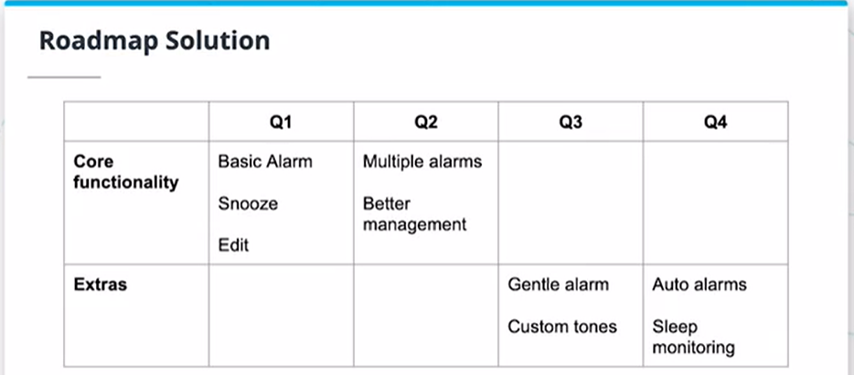

-   Q1
    -   Basic Alarm
    -   Snooze
    -   Edit
-   Q2
    -   Multiple alarms
    -   Better management for multiple alarms
-   Q3
    -   Gentle alarm
    -   Custom tones
-   Q4
    -   Auto alarms
    -   Sleep monitoring

> The important part is that the most critical features were earlier on
> in the roadmap, compared to nice to haves and explorations which came
> later.

### 13. Recap

You’ve reached the end of the Role of a PM lesson. We covered the
following topics:

The Role of a PM \* What a PM Does \* Who PMs work with \* Identifying
Requirements \* The Roadmap & PRD

At this point, you should be able to:

-   Understand the purpose of the PM role
-   Understand what a PM does during the different stages of the Product
    Development Cycle
-   Identify key cross-functional partners and customize communications
    based on understanding of their key priorities
-   Describe different methods for gathering requirements
-   Define the components of a PRD and how to complete each component \*
    including documenting requirements

------------------------------------------------------------------------

### Glossary

|  Term   | Definition                                                                                                                                                                                                             |
|:-------:|:-----------------------------------------------------------------------------------------------------------------------------------------------------------------------------------------------------------------------|
|  i18n   | Internationalization. A team and/or process that helps you bring your product to new markets around the globe.                                                                                                         |
|   PgM   | rogram Manager. A person who helps a variety of teams (engineering, design, ops, etc) execute against the product roadmap. A program manager keeps the team productive and on track, as well as flags risks.           |
|   PR    | Public Relations. A team that helps you tell the story about your product with the public and media.                                                                                                                   |
|   PRD   | Product Requirements Doc. A document written by a product manager that describes why a product should be built and what the product should do, as well as how to measure success of the product.                       |
|   QA    | Quality Assurance. A team that creates test plans and tests your product to identify and prevent bugs and issues from entering production and affecting users.                                                         |
| Roadmap | A document that describes when specific products and features will be built.                                                                                                                                           |
|   TPM   | Technical Program Manager. A more technical program manager, who works closely with engineering teams to execute against the product roadmap. A TPM is more involved in the technical details of software development. |
