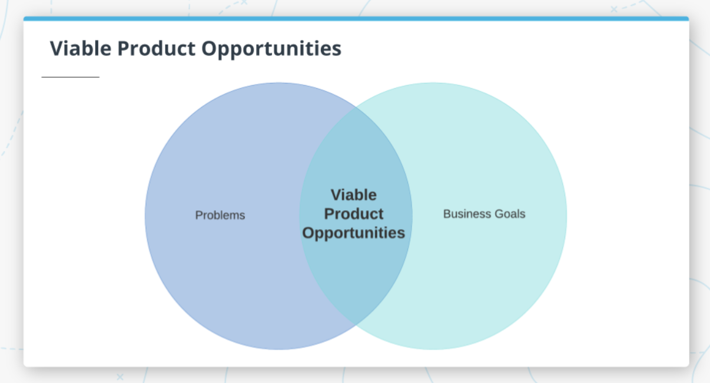
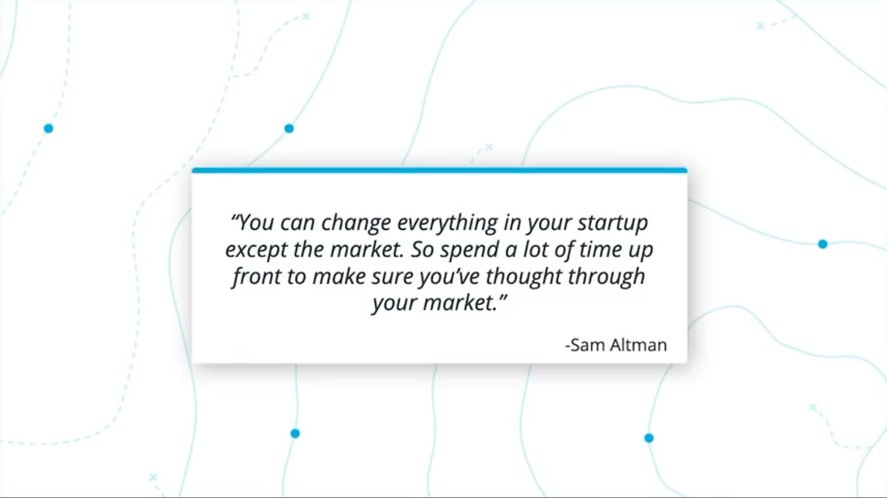

# `Lesson 03` Product Strategy

#### Tags

* Title: Problem Identification
* Date: 30/03/2022
* Course: Product Manager Nanodegree
    * Instructor: Alex King
    * COD: ND036

***

## Class Notation

### 1. Lesson Intro

In this lesson, we will cover the following topics:

* Identifying Opportunities;
* Understanding the Market;
* The Target User;
* Total Addressable Market;
* Creating & Evaluating Hypotheses, and;
* Creating a business case;

> The most challenging thing to do is to decide what not to solve.

At the end of this lesson, you’ll be able to:

* Identify problems that are worthwhile to solve
* Understand the market through research
* Identify your target user and build user personas
* Calculate the total addressable market (TAM) for your product
* Calculate the return on investment (ROI) for solving a problem
* Define hypotheses about your product that need to be validated
* Test your hypotheses by putting them in front of users
* Understand the components required to build a business case

### 2. Identifying Opportunities

> Finding the right problem to solve is critical for the success of your product! If you aren’t focusing on the right problems, your product will fail. This is something that both big and small companies struggle with. You’ll have to work through constraints and tradeoffs

How to figure out which problem to solve?

There are many ways to discover it:

* Market Research: What products or related products already exist? What's the competition like? What are the trends
* User Research: Ethnographies, interviews, and focus groups.
  * >It's is super important to go out and talk to users.
* Product Data: If you already have a product and are looking for a follow-on product, you may use it to develop new features.
* Support Data: The PM could find the issues that your users are running into.
* Efficiency Gains: Automating the manual process could free up more bandwidth for the team to solve new problems.

Why is it so important to solve the right problem?

* You have a limited amount of resources, and;
* You have a limited amount of time.

Figure 1 shows the tradeoff between **Business Goals** (Revenue, New Users, Engagement, Costs Reduction, Churn Reduction, etc.) and **Problems**.
s

If we overlap these two objectives, we will find **Viable Product Opportunities**.

its means:

> You can have an incredible team and develop an excellent piece of technology, but if this product does not resonate with the market, none of that will matter.

### 3. Understanding the Market

### 4. Exercise: Industry Trends

### 5. Solution: Industry Trends

### 6. Target User

### 7. Exercise: Target User

### 8. Solution: Target User

### 9. Total Addressable Market

### 10. Exercise: TAM

### 11. Solution: TAM

### 12. ROI

### 13. Creating & Evaluating Hypotheses

### 14. Building a Business Case

### 15 Lesson Recap

### Glossary

| Term | Definition |
|:----:|------------|
|ARPU (_Average Revenue per User_)|The average amount of revenue you receive for each user you have, usually measured by year.|
|Efficiency gain|Something that results in a process being less expensive to complete (shorter amount of time, less money, etc).|
|Focus group|A small group of people you can present concepts to in order to see how they react. Generally this will be a diverse group of people and you will have specific questions you’d like to get their feedback on.|
|Payback period|The amount of time that it takes for a product to recoup the initial investment required to build it|
|ROI (_Return On Investment_)|The ratio between the net profit and amount of investment. A high ROI indicates more impact with less effort.|
|TAM|Total Addressable Market. A measure of the revenue opportunity for a product.|
|Target User|A representation of a group of users with shared characteristics.|
