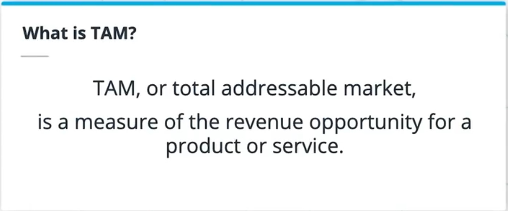
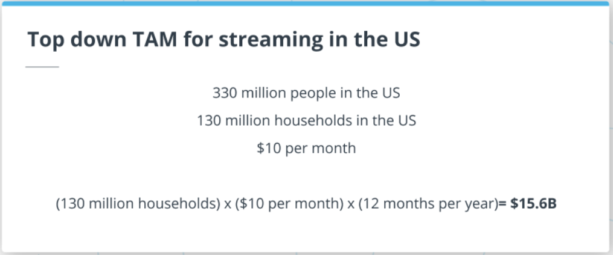

`Lesson 03` Product Strategy
================
Anderson Uyekita

-   Title: Problem Identification
-   Dates:
    -   From: 30/03/2022
    -   To: 05/05/2022
-   Course: Product Manager Nanodegree
    -   Instructor: Alex King
    -   COD: ND036

------------------------------------------------------------------------

## 1. Lesson Intro

In this lesson, we will cover the following topics:

-   Identifying Opportunities;
-   Understanding the Market;
-   The Target User;
-   Total Addressable Market;
-   Creating & Evaluating Hypotheses, and;
-   Creating a business case;

> The most challenging thing to do is to decide what not to solve.

At the end of this lesson, you’ll be able to:

-   Identify problems that are worthwhile to solve
-   Understand the market through research
-   Identify your target user and build user personas
-   Calculate the total addressable market (TAM) for your product
-   Calculate the return on investment (ROI) for solving a problem
-   Define hypotheses about your product that need to be validated
-   Test your hypotheses by putting them in front of users
-   Understand the components required to build a business case

## 2. Identifying Opportunities

> Finding the right problem to solve is critical for the success of your
> product! If you aren’t focusing on the right problems, your product
> will fail. This is something that both big and small companies
> struggle with. You’ll have to work through constraints and tradeoffs

How to figure out which problem to solve?

There are many ways to discover it:

-   Market Research: What products or related products already exist?
    What’s the competition like? What are the trends
-   User Research: Ethnographies, interviews, and focus groups.
    -   It’s is super important to go out and talk to users.
-   Product Data: If you already have a product and are looking for a
    follow-on product, you may use it to develop new features.
-   Support Data: The PM could find the issues that your users are
    running into.
-   Efficiency Gains: Automating the manual process could free up more
    bandwidth for the team to solve new problems.

Why is it so important to solve the right problem?

-   You have a limited amount of resources, and;
-   You have a limited amount of time.

Figure 1 shows the tradeoff between **Business Goals** (Revenue, New
Users, Engagement, Costs Reduction, Churn Reduction, etc.) and
**Problems**. s 

If we overlap these two objectives, we will find **Viable Product
Opportunities**.

its means:

> You can have an incredible team and develop an excellent piece of
> technology, but if this product does not resonate with the market,
> none of that will matter.

## 3. Understanding the Market

> Understanding the market is critical to building successful products.
> Some markets are better than others. And some products do a better job
> than others. You’ll want to make sure that your product satisfies the
> needs of the market.

That is you need to find the **product/market fit**. Figure 3 presents
the definition of it according to Marc Andreesen.

### What makes a good market?

> Understanding the market allows you to focus on solving the right
> problem. Keep in mind that some markets are better than others.

Factors to consider when analyzing the market.

| Characteristics | Description                                                                                                                                                                                            |
|:---------------:|--------------------------------------------------------------------------------------------------------------------------------------------------------------------------------------------------------|
|      Size       | If you have a small market, it will be challenging to monetize over this audience.                                                                                                                     |
|     Growth      | What is the future of this market? Is it going to grow? If you develop a product for a decadent market, you will be in trouble.                                                                        |
|   Acquisition   | How easy is it to get new customers? How easy is it to convince competitors’ users to migrate to your product? Then, think about the friction it could lead to the user switching from iOS to Android. |

Figure 04 presents a simple comparison between with and without
Product/Market Fit.

### Ways to get more Market insights

> To better understand the market, you’ll want to talk to your users and
> customers. But before you do, you can look at some of these things to
> get more familiarity with the market:

-   Online research: To understand what is happening in the market and
    stay up-to-date.
-   Headlines & News: To be aware of what is relevant to the problem you
    are focused on
-   Similar products: Study the competition and see how they approach
    the problem (What they are doing well and struggling).
-   Trends: Can also provide crucial insights
    -   Mary Meeker’s Internet Trends
    -   Google Trends

## 4. Exercise: Industry Trends

> Imagine that the team is interested in building a product to help
> people better track their fitness and improve their health over time.
> Spend a little bit of time doing some research to better understand
> current trends in the fitness tracking market.
>
> Here are some questions to get you started:
>
> -   What benefits does improving fitness provide?
> -   What products are already in the market?
> -   How much do people spend on health/fitness?
> -   What are the different ways to deliver fitness tracking?
>     -   What are the pros and cons?

## 5. Solution: Industry Trends

Benefits \* Controls weight \* Combats health conditions & diseases \*
Improves mood \* Boosts energy \* Sleep better

Existing Products \* Smartwatches \* Apps \* Smart Ring

Spending \* \$155 / mo \* \$1,860 / yr

|  Category   | Amount |
|:-----------:|:------:|
| Supplements |  \$56  |
|  Clothing   |  \$35  |
|     Gym     |  \$33  |
| Meal Plans  |  \$17  |
|  Trainers   |  \$14  |

## 6. Target User

> Identifying a target user is important, because it makes it very clear
> who you are building the product for. Oftentimes, a problem will best
> be solved in different ways for different types of users. Identifying
> a target user creates focus and lets you focus on solving the needs of
> that specific target user.

Remember, if you are building and designing a calculator for a Grade
School, it will be very different if you make it for Scientists, as
shown in Figure 5.

These users have very different needs and very different goals. In
addition, those audiences have different purchasing power.

For this reason, the PM must keep in mind your target user because they
will help them answer a lot of questions about:

-   What your product is, and;
-   What it should do.

> Your target user is who you are building your product for.

In other words, you are looking for users with shared characteristics
who are likely interested in your product. To find this audience (users
with shared characteristics), the PM will need to:

-   Look to data:
    -   Market research
    -   Interviews, Conduct Surveys, run Focus Group
    -   Data Customer: If you already have a customer, you could use it
        to extract insights.

Once you have gathered info/data from the users, you will be able to
identify the users’ characteristics.

-   Users’ characteristics:
    -   Demographics: How old is your audience? Where do they live?
    -   Motivations: What gets them excited?
    -   Goals: What are the users trying to solve/accomplish?
    -   Frustrations: What are the current users’
        issues/problems/challenges?

After identifying user characteristics, the PM will be able to identify
the trends across those data gathered, so the PM can create User’s
Personas to represent them.

> A User Persona is a fictional person you create who might use your
> product.

The PM will refer to the User Persona to stress test and challenge some
of your ideas during the product development.

-   Does this decision solve Sam’s frustrations?
-   Would Sam be able to afford this product?

### Creating a Persona

The creation process of a persona consist in define:

-   Name: Simple name that fits with the user’s attribute;
-   Photo: It is a nice touch to include a photo;
-   Quote: Key insight about the user – It is vital to use real quotes
    from the users interviewed during the research;
-   Description: This is a bit longer them the quote and tries to tell a
    story about the persona. It does not need to be super in-depth;
-   Frustrations: Need to point out the frustrations or challenges;
-   Goals: You also need to point out the users’ goals, which the
    product should help them to achieve;
-   Motivations: Lastly, you need to point out what is the users’
    motivations

Figure 6 shows a Persona Example of a student who has a problem getting
exercise.

## 7. Exercise: Target User

> Given the market research that you’ve done so far, create 3 user
> personas for a fitness tracker. Keep in mind, that in the real world
> you would also want to make sure that you get data from real users
> through interviews or surveys before building any personas. For each
> persona, create a name and some information about them. Also include
> their frustrations and goals.

## 8. Solution: Target User

## 9. Total Addressable Market

> Keep in mind that **TAM is not a measure of your revenue or future
> revenue**.

The TAM helps you to understand the market size. A larger TAM means a
larger opportunity. However, a large TAM does not guarantee your product
will be successful.

Figure 11 shows the TAM Formula.

Where: \* ARPU stands for The average amount of revenue you receive for
each user you have, usually measured by year.

There are 3 (three) maners to calculate the TAM:

-   Top-down;
-   Bottom-up, and;
-   Value Theory.

### Top-down

> You start with a high level view of the economy, and then narrow that
> down based on factors like demographics. For example, you usually will
> start will everyone in the world and narrow down that audience to
> people who are interested in your product.

In the top-down approach, we use very crude assumptions. For this
reason, we have estimated the TAM as USD 241 billion.

### Bottom-up

> This involves using **known data points that you have** (data from
> early customers and sales) that you could extrapolate to represent a
> larger market opportunity. For example, if you are already selling a
> product in one region and were considering selling it globally.

Current users data from California: \* 1 USD per 1 liter; \* 10 millions
of liter per day, and; \* California population is about 40 million
people.

Due to the data from California, we could refine the TAM using the
bottom-up approach. So the TAM estimated is USD 30.1 billion.

### Value Theory

> Generally used for **new product categories where you don’t have much
> information to base estimates on**. This involves conducting market
> research to understand: \* How much people would pay for your product,
> and; \* how many potential customers you have.

The PM needs to answer those two questions by doing a lot of research
and talking with the user to find the answer for how much the user is
willing to pay and estimate the potential number of customers.

## 10. Exercise: TAM

> Calculate the TAM for streaming media services in the US

## 11. Solution: TAM

TAM for streaming in the US is \$15.6B

## 12. ROI

The ROI (return on investment) is a measure used to prioritize
activities/projects of a product. In other words, ROI is a way to
measure the efficiency of an investment. Figure 15 shows the ROI
formula.

Where: \* Amount gained: Could be costs savings and increase of revenue.

> The higher the ROI, the better the business outcome.

This means you could be able to create more impact with less effort.

In the case of software development, the ROI will be a little different,
according to Figure 16.

Where:

-   Cost of development time: This could be an estimate based on the
    team/people involved and how long it takes to complete the project.

### Prioritization

Suppose we have calculated the Product ROI of 4 projects/problems.
Figure 17 presents the details.

In this problem, you have a budget constraint of \$5.

Insight: \* At first glance, we could elect Problem A as the better
option to be solved. You will spend all your budget. \* However, If you
make a composition of Problem B and D, you will reach \$20 of impact and
\$4 of cost, which means you will save \$1.

If you have calculated the ROI for the problems, you will be able to
understand the better choices better, as presented in Figure 18.

Takeaways: \* The best ROI is related to Problem D; \* The second one is
Problem A, but we can not afford (we only have \$4), and; \* The last
Problem selected is Problem D.

### Payback

What is the payback period?

> The amount of time that it takes to regain the initial cost of
> building the product.

Figure 18 shows the payback of Problem A to D.

> Calculating ROI and payback periods are two important tools to help
> you understand if it makes sense to solve a problem. Projects with
> positive ROIs will cover the investment required to build the product…
> Projects with negative ROIs will not and won’t make sense to pursue.
> Calculating the payback period allows you to understand how long it
> will take before the product recoups the upfront investment required
> to build it.

## 13. Creating & Evaluating Hypothesis

### Creating Hypothesis

> Before you build a product… you want to be sure that it will be
> successful. You can create hypotheses to make sure that your
> assumptions about your product are correct– and that you are solving a
> real problem for real people. After creating your hypotheses, you can
> test them to see if they are true / still accurate in the real world.

The PM must create a hypothesis to validate some assumptions. Testing
the hypothesis is a manner to check the accuracy of your product.

The are a couple of types of Hypothesis:

|      Type       | Description                                                                                   | What you really need to answer                                                                                                                                                                                            |
|:---------------:|-----------------------------------------------------------------------------------------------|---------------------------------------------------------------------------------------------------------------------------------------------------------------------------------------------------------------------------|
|  Customer Need  | What are the specific goals of your customers? How could your product be able to solve it?    | Is it a real problem? is there urgency in finding a solution for this problem? Painkiller vs Vitamin?                                                                                                                     |
|  Your Solution  | Does your solution meet/solve the user’s needs?                                               | Does it really solve the problem? What alternatives does the customer have? Is your solution way better?                                                                                                                  |
| Differentiation | Is your solution differentiated? How does your solution compare to other solutions out there? | Is it different? Is our product the same or different? How is it different? What does it do that other products don’t?                                                                                                    |
|      Value      | Does your product create enough value for users?                                              | Does your solution create enough value for users that they are willing to pay for it? How much will people pay for it? What can you do to increase willingness to pay? How much do people pay currently for alternatives? |

### Evaluating Hypothesis

You can test or evaluate your hypothesis in several different ways: \*
User Interviews: Useful when you have a prototype; \* Focus Group; \*
Surveys: When you need a lot of answers, and you have limited questions,
and; \* Design Sprint.

If you find that:

-   You are not addressing a customer need
-   Your solution isn’t providing value
-   Your product isn’t differentiated enough
-   There’s no willingness to pay…

> **Stop!!** It’s not worth pursuing this idea in its current form
> because you won’t have product/market fit. You should go back and
> tweak which customer you are focusing on… or your solution.. Or
> pricing model.

> Before you build a product… you want to be sure that it will be
> successful. Creating hypotheses around the problem, your solution,
> differentiation, and value and then testing them is a good strategy to
> make sure that you find product/market fit.

## 14. Building a Business Case

Once you have validated the hypothesis and have confidence that there is
a real problem to solve, you will need to build a Business Case to
justify the investments.

> Why should the company do this and invest in it?

The goal is to convince the sponsors and stakeholders to approve the
project. However, the Business Case only needs to be built in the case
of a new product (entirely new brand), which means, for new features for
an existing product, just the PRD is enough.

> Does it make sense to build this?

Figure 20 presents all the Topics you want to make sure are covered in
your Business Plan.

Based on the topics above, the business case should organize into the
following sections:

> **Executive Summary** The Executive summary summarizes the entire
> document, including the recommendation. You want to make sure that it
> has enough detail that if it’s the only thing people read they will
> understand the justifications for building the product. It’s also the
> first thing people read and usually **the last thing you will write to
> make sure that everything is cohesive**.

> **Problem Statement** The Problem Statement explains the problem you
> are trying to solve, as well as the associated goals. It should also
> clearly link the problem back to the business strategy and goals.

> **Analysis of Product Opportunity** In the Analysis of Product
> Opportunity section, you discuss the merits of why solving the problem
> is important. You’ll usually want to touch on the cost of the problem
> and the size of the opportunity. Additionally, you can discuss what
> would happen if you didn’t solve the problem.

> **Possible Solutions** In the Possible Solutions section, you will
> describe the potential solutions to the problem. For each solution,
> you should discuss benefits, cost, timeline, and risks.

> **Recommended Approach** And finally in the Recommended Approach
> section, you put forward your recommendation for which solution is the
> best and why.

Other tips to keep in mind:

-   Tailor it to your audience
-   Shorter is better
-   Make it interesting
-   Demonstrate business value

## 15 Lesson Recap

> You’ve reached the end of the Problem Identification lesson. We
> covered the following topics:
>
> -   Identifying Opportunities
> -   Understanding the Market
> -   The Target User
> -   Total Addressable Market
> -   Creating & Evaluating Hypotheses
> -   Creating a business case
>
> At this point, you should be able to:
>
> -   Identify problems that are worthwhile to solve
> -   Understand the market through research
> -   Identify your target user and build user personas
> -   Calculate the total addressable market (TAM) for your product
> -   Calculate the return on investment (ROI) for solving a problem
> -   Define hypotheses about your product that need to be validated
> -   Test your hypotheses by putting them in front of users
> -   Understand the components required to build a business case

## Glossary

|               Term                | Definition                                                                                                                                                                                                     |
|:---------------------------------:|----------------------------------------------------------------------------------------------------------------------------------------------------------------------------------------------------------------|
| ARPU (*Average Revenue per User*) | The average amount of revenue you receive for each user you have, usually measured by year.                                                                                                                    |
|          Efficiency gain          | Something that results in a process being less expensive to complete (shorter amount of time, less money, etc).                                                                                                |
|            Focus group            | A small group of people you can present concepts to in order to see how they react. Generally this will be a diverse group of people and you will have specific questions you’d like to get their feedback on. |
|          Payback period           | The amount of time that it takes for a product to recoup the initial investment required to build it                                                                                                           |
|   ROI (*Return On Investment*)    | The ratio between the net profit and amount of investment. A high ROI indicates more impact with less effort.                                                                                                  |
|                TAM                | Total Addressable Market. A measure of the revenue opportunity for a product.                                                                                                                                  |
|            Target User            | A representation of a group of users with shared characteristics.                                                                                                                                              |
