`Lesson 04` Vision & Strategy
================
Anderson Uyekita

-   Date:
    -   From: 05/04/2022
    -   To: XX/04/2022
-   Course: Product Manager Nanodegree
    -   Instructor: Alex King
    -   COD: ND036

------------------------------------------------------------------------

## 1. Lesson Intro

> In this lesson, we’ll cover the following topics:

|        Topic         | Description                                                                                                                                             |
|:--------------------:|---------------------------------------------------------------------------------------------------------------------------------------------------------|
|        Vision        | This is about ultimately defining what it is you’re trying to build.                                                                                    |
|       Strategy       | This is about how you’re going to get there.                                                                                                            |
|   Business Models    | Mapping out all the components that will be required to build your product for your customers, as well as different revenue models for capturing value. |
| Competitive Analysis | Understanding other products that are in the market and how your product compares to them.                                                              |
|         MVP          | What’s the simplest product that you can get to market the fastest                                                                                      |
|         KPI          | How do you measure your progress and success                                                                                                            |

> Learning objectives
>
> -   Define and craft compelling Vision
> -   Identify strategic areas to invest in
> -   Build a Business Model Canvas
> -   Conduct a Competitive Analysis
> -   Understand the importance of defining MVP
> -   Define KPIs

## 2. Vision

### 2.1. What is vision?

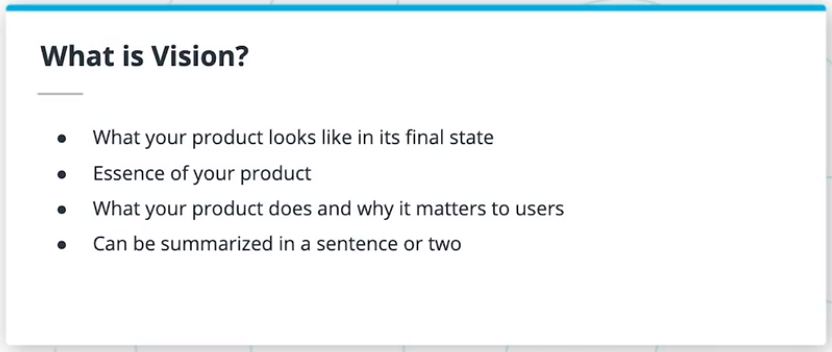

-   Vision describes what your product will look like when it gets to
    its final state;
-   It explains the essence of your product;
-   What it’ll do and why it matters to your users, and;
-   Can be summarized in a sentence or two with an ambitious goal.

Figure 1 presents an example of the vision of Google Wi-fi.

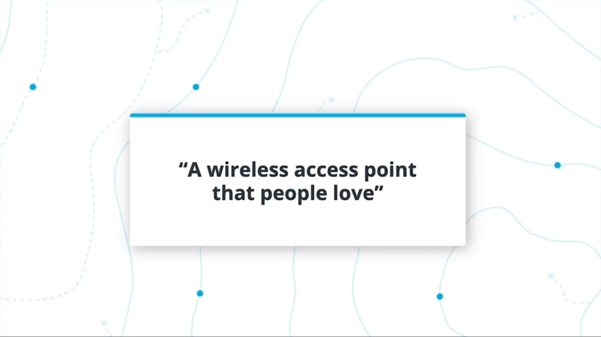

The vision will guide every single decision as were building the
product. However, **vision** is more than just coming up with a sentence
or two.

Vision needs to tell a compelling story about:

-   What you are building;
-   Who it’s for, and;
-   What it matters.

The PM does not need to go deep into exactly what the product will look
like. Instead, focus on what it will do at a high level.

### 2.2. Why Vision Matters?

Vision is really important for a couple of reasons:

1.  Gets the team excited and motivated about building the product, and;
2.  Serves as a north star for guiding the team and decision making.

> Because vision will impact every single aspect of your product. It’s
> really important to be thoughtful when you’re crafting your vision.

Your vision should flow down into everything that you do

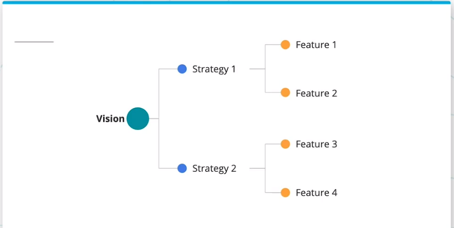

For this reason, the vision will guide your strategy and, consequently,
the features roadmap.

### 2.3. Creating vision

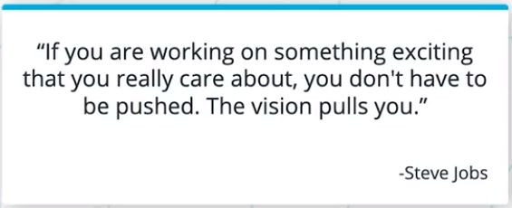

> “If you are working on something exciting that you really care about,
> you don’t have to be pushed. The vision pulls you.” – Steve Jobs

You must make sure your vision shares the following characteristics:

|          Characteristics           | Description                                                                                                                                                                                                                                                                                                          |
|:----------------------------------:|----------------------------------------------------------------------------------------------------------------------------------------------------------------------------------------------------------------------------------------------------------------------------------------------------------------------|
|             Inspiring              | You want the vision to get the team excited about the product. Please focus on the problem you are solving for the users and why it matters. How will the product change the user’s day or even their life?                                                                                                          |
|             Ambitious              | Think big. The vision must be broad and open-ended to challenge the team to think about the product differently. It is not necessary to detail exactly all the features because you will work on it with the team (it will also give you leeway to change, adapt and pivot the product as you learn new information) |
|          Easy to explain           | The vision must be easy to explain, and the people must understand it. This means you will be able to summarize your vision into a short, concise sentence or two.                                                                                                                                                   |
|   Something the team believes in   | It is also important that your vision is something that the team believes in                                                                                                                                                                                                                                         |
|   Something you evolve over time   | The vision should evolve.                                                                                                                                                                                                                                                                                            |
| Something you share out frequently | The vision is something you need to share frequently with all teams to be sure everyone is on the same page.                                                                                                                                                                                                         |

Bear in mind that you also need to tailor the way you will tell the
vision for each audience based on the activities that they care about
the most.

Here are a few examples of vision:

> Google: To provide access to the world’s information with one click.

> Google Wifi: A wireless router that people love

> Facebook: Connect with friends and the world around you

> Amazon: Earth’s most customer centric company and a place where people
> can come to find and discover anything they might want to buy online

Vision serves as a **north sta**r to guide the team and decision making
as your product is being developed. It explains what you’re building,
who it’s for, and why it matters. Vision also gets the team excited and
motivated about building the product.

**Further readings**

-   [Product
    Vision](./Data/What%20is%20a%20Product%20Vision%20Statement_%20_%20Definition%20and%20Overview.pdf)
-   [4 Experts Reveal How to Create a Strong Product
    Vision](./Data/4%20Experts%20Reveal%20How%20to%20Create%20a%20Strong%20Product%20Vision.pdf)

## 3. Strategy

Strategy is all about how you are going to turn your vision into reality
and takes the following things into account:

|            Things             | Description                                                                                                                                                                                                                |
|:-----------------------------:|----------------------------------------------------------------------------------------------------------------------------------------------------------------------------------------------------------------------------|
|          User needs           | • Who is your target user? • What are their needs that could be solved by your product?                                                                                                                                 |
|         Key Features          | • What are the key primary features that solve the user’s needs and create value to them? • Will these features results in people using the product? • Will these features convince people to buy the product?       |
| Competitors & Differentiation | • How does your product compare to others in market? • What areas do you want to differentiate in?                                                                                                                      |
|        Business Goals         | • What are the business goals for this product? (Usually, this will be related to revenue, but it is not necessarily always the case.) • What KPIs can you use to measure these goals? How can you measure these goals? |
|            Trends             | • How is the market changing over time? How are user behavior and needs changing?                                                                                                                                       |

When you create strategy, you want to make sure that it’s:

-   A balance between features, user and market needs, and business
    goals
-   Creating building blocks for how to get to your vision
-   High level, but with a little more detail
-   Goal oriented, and preferably measurable

**Further Reading**

-   [What is Good Product
    Strategy?](./Data/What%20is%20Good%20Product%20Strategy_.%20“What%20is%20your%20Product%20Strategy_%20YOU…%20_%20by%20Melissa%20Perri%20_%20Medium.pdf)

## 4. Business Model

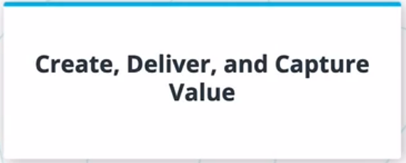

A business model describes how a business creates, delivers, and
captures value. You can create a business model canvas, which captures a
number of different components that will impact your ability to create
and bring a product to market, including things you need to build the
product and their associated costs, the value prop for your product, and
getting your product to your customers and the associated revenue
streams.

Figure 2 presents the business model canvas (It is a helpful tool to map
out a business model, which was created by Alexander Osterwalder).

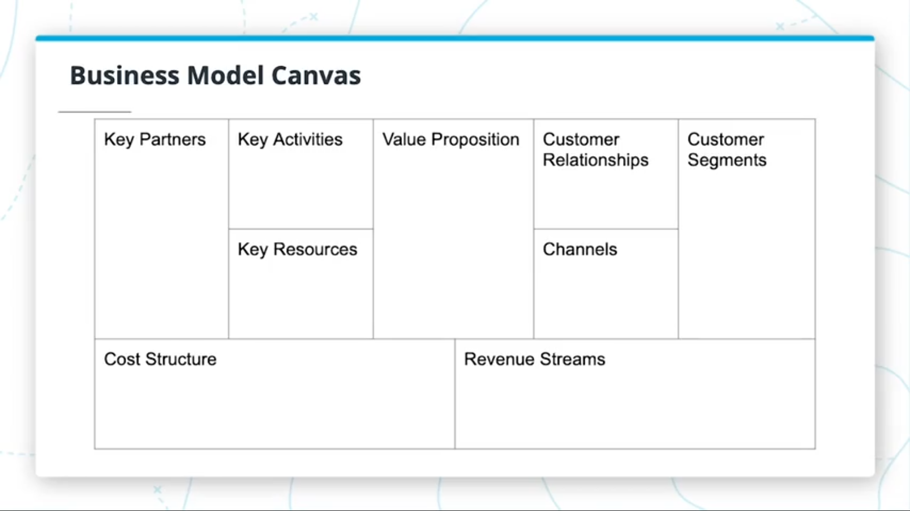

The business model canvas includes the following components:

-   Left Side (Things that need to happen in order to build the
    product):
    -   Key Partners - help build or deliver the product to users
    -   Key Activities - what you need to do to build and deliver the
        product
    -   Key Resources - things that you need to build the product
    -   Cost Structure - cost of building the product
-   Middle: Value proposition - why people would want your product
-   Right Side (Customers):
    -   Customer Relationships - how you build relationships
    -   Channel - how you get the product to customers
    -   Customer Segments - different types of customers
    -   Revenue Streams - how you get money from customers

Zoom Business Model Canvas Example is presented in Figure 03.

-   <https://zoom.us>

> The business model canvas is a powerful tool to understand all the
> components that go into creating a product, understanding its value,
> and how to get it to your customers.

|       Component        | Description                                                                                                                                                                                                                                                                                                                  | Zoom Example                                                                                                                                                                                                    |
|:----------------------:|:-----------------------------------------------------------------------------------------------------------------------------------------------------------------------------------------------------------------------------------------------------------------------------------------------------------------------------|:----------------------------------------------------------------------------------------------------------------------------------------------------------------------------------------------------------------|
|      Key Partners      | Key Partners help build or deliver the product to users including re-sellers or other partners like payment processors.                                                                                                                                                                                                      | • Hardware partners outfit conference rooms with cameras, TVs, and tablets. • System integrators integrate their technology into existing spaces • Payment processors collect money from their customers  |
|     Key Activities     | Key Activities are the things that need to happen in order to build your product                                                                                                                                                                                                                                             | • Technology development • Sales and support                                                                                                                                                                 |
|     Key Resources      | Key resources are things that you need in order to deliver value to the user including people, intellectual property and financial backing                                                                                                                                                                                   | • Data centers are important in order to deliver the streaming video to participants • Compression Algorithm that allows Zoom to deliver high-quality video while reducing the amount of bandwidth required. |
|     Cost Structure     | Cost Structure looks at all of the costs that are associated with building the product, including fixed costs, like salary of the development team, and variable costs that increase as the product grows, like data center capacity. It’s also important to consider which activities and resources are the most expensive. | • People • Data centers                                                                                                                                                                                      |
|   Value Proposition    | The Value Proposition explains why someone would want your product.                                                                                                                                                                                                                                                          | • A video conferencing product that works really well • Can use used on phones, laptops, and in conference rooms that have TVs • Can scale to support over a 1,000 participants in a call                 |
| Customer Relationships | Customer Relationships considers how you are going to build a relationship with your customer, including through interactions in the product, both the person using the product and the person who purchases the product.                                                                                                    | • End of call rating                                                                                                                                                                                            |
|        Channels        | Channels is about how you get the product to the customer. It’s also important to consider which channels work best and which are the most cost effective.                                                                                                                                                                   | • Website where people can sign up and purchase the product directly • Referrals from current customers • Resellers who sell their product on Zoom’s behalf                                               |
|   Customer Segments    | Customer segments describe who your customers are and which customer is the most important.                                                                                                                                                                                                                                  | • Distributed people or teams who need to collaborate and communicate: Small and mid-sized business, Enterprise, Education, Healthcare, Government                                                              |
|    Revenue Streams     | Revenue Stream is what customers are willing how they pay.                                                                                                                                                                                                                                                                   | • Subscriptions                                                                                                                                                                                                 |

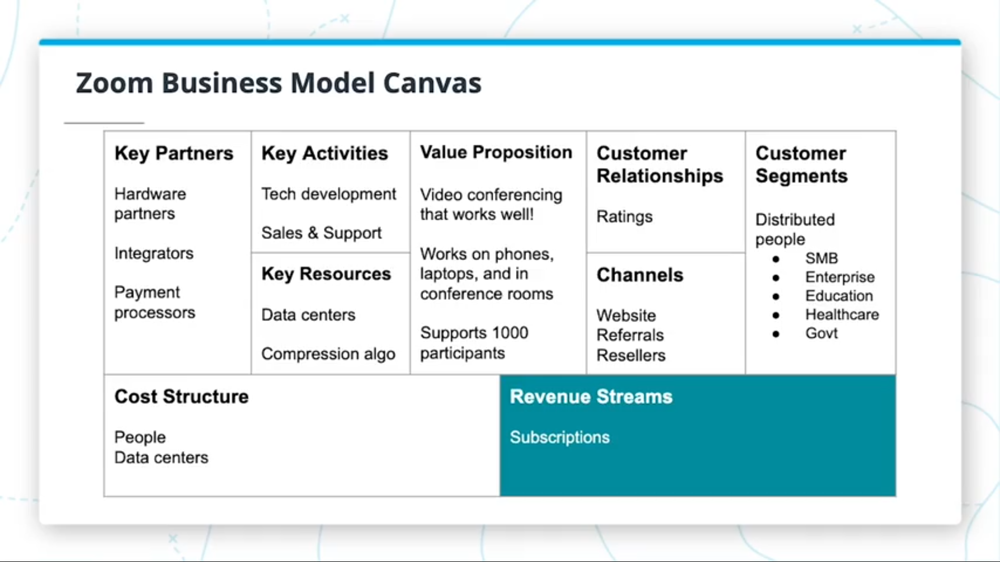

## 6. Revenue Models

There are lots of different revenue models that you can sell or monetize
your products, but some of the most common are:

|          Model           | Description                                                                                          |
|:------------------------:|:-----------------------------------------------------------------------------------------------------|
|         **Ads**          | Revenue from third parties for showing targeted advertisements                                       |
| **Purchase / Licensing** | Revenue from a single moment when a user purchases the right to use the product                      |
|     **Pay per use**      | Revenue whenever the user uses the product based on how much of the product was used                 |
|     **Subscription**     | Revenue from a user on a continuous basis in exchange for ongoing access to the product              |
|       **Freemium**       | Access to limited parts of the product at no cost, with other parts of the product requiring revenue |

Note that sometimes revenue models can overlap. For example, you could
have a *Fremium* model supported by *Ads* with the goal of users
converting to a subscription.

### 6.1. Ads

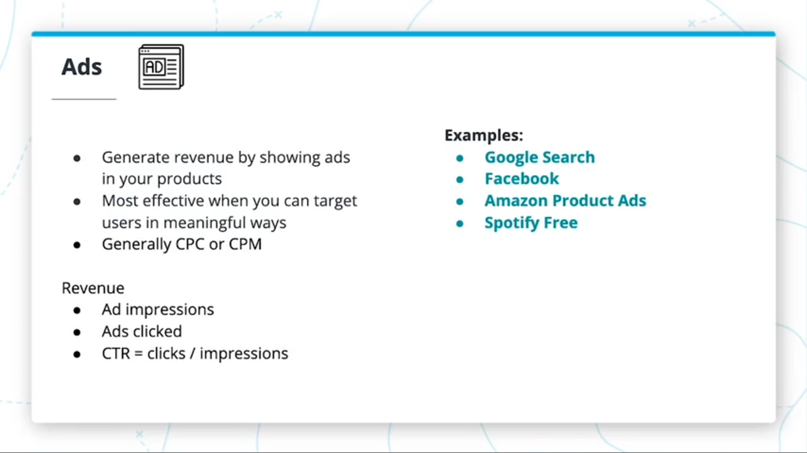

### 6.2 Fremium

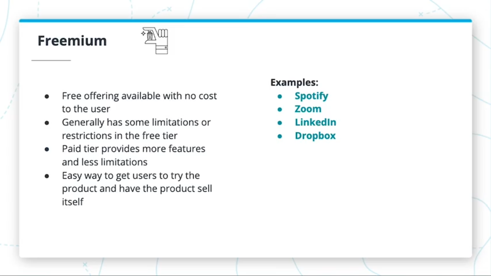

### 6.3 Purchase / Licensing

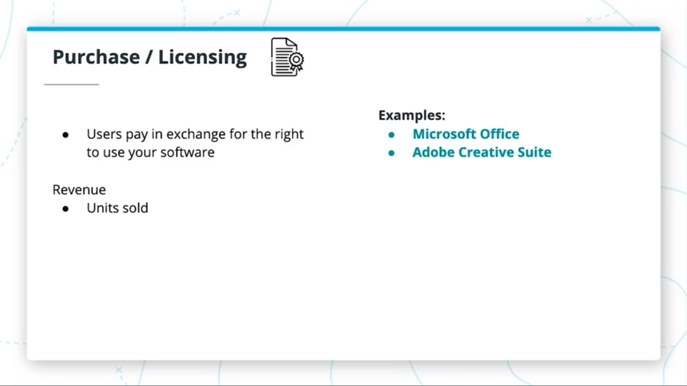

### 6.4 Pay per Use

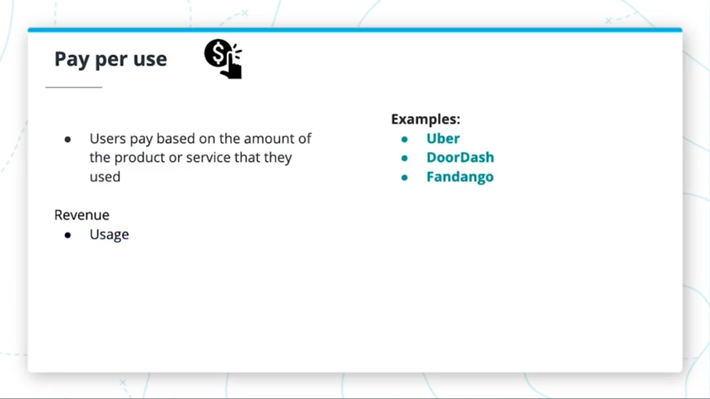

### 6.5 Subscription

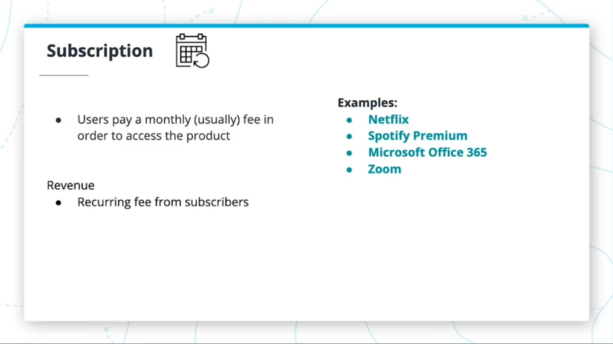

> There are also a variety of different revenue models that you can
> consider when creating a product. It’s important to understand how
> users perceive the value of your product and how they interact with
> your product when creating your revenue model.

**Further readings**

-   [Business Model Canvas
    Examples](./Data/Business%20Model%20Canvas%20Examples%20_%20Automobile%20&%20Amazon%20Case%20Studies.pdf)
-   [10 Most Popular Startup Revenue
    Models](./Data/The%2010%20Most%20Popular%20Startup%20Revenue%20Models.pdf)

## 7. Exercise: Business Model

Business Model Task List

> Create a business model canvas for fitness tracker to identify what’s
> needed to build the product, its value, and how to deliver the product
> to customers.

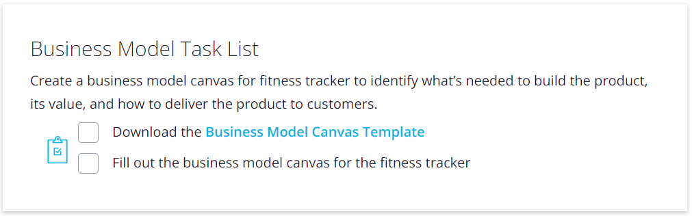

## 8. Solution: Business Model

|       Component        | My Fitness Tracker                                                                                                                                                                                                                |
|:----------------------:|:----------------------------------------------------------------------------------------------------------------------------------------------------------------------------------------------------------------------------------|
|   Customer Segments    | • People who want to improve fitness with goals including weight loss or training to compete in a competition, like a marathon                                                                                                    |
|   Value Proposition    | • Help users improve and track their fitness over time • Connecting user to a virtual trainer who can customize workout plans • Allow users to track and share their progress with friends                                  |
|     Key Activities     | • Software development to build the product                                                                                                                                                                                       |
|     Key Resources      | • A fitness specialist who can help us to understand the science behind different types of exercises to achieve fitness goals                                                                                                     |
|      Key Partners      | • Fitness trainers to match to paying users to provide tailored coaching • Gyms so we can match users with a trainer at their local gym • Integration with some exercise machine manufacturers to capture user workout data |
|     Cost Structure     | • People developing the product • Trainers and partnerships                                                                                                                                                                    |
| Customer Relationships | • Sending out a weekly progress summary that highlights the progress that the user has made towards their goals                                                                                                                   |
|        Channels        | • Directly downloading the app • Invitation from a friend – either for sharing progress or for a challenge • Partnering with gyms                                                                                           |
|    Revenue Streams     | • Ad-supported free tier • Paid subscription                                                                                                                                                                                   |

## 9. Competitive Analysis

### 9.1. What is Competitive Analysis?

> The Competitive analysis in its simplest form is identifying other
> similar products in the market, including the users each product is
> targeting. At a high level, competitive analysis includes:

The Competitive Analysis identifies other similar products in the
market, including the users’ target of each product. Then, understand
each competitor’s product strategy (just looking at the product and
marketing materials).

After this analysis, you will be able to identify the strengths and
weaknesses of each competitors’ products. These insights allow you to
better predict shifts in market behavior and trends.

Figure 5 shows a resume of the critical points of Competitive Analysis.

### 9.2. What does competitive analysis include?

> The Competitive analysis could look at many different factors,
> including things like funding, support, and global presence.

However, focusing on products insights, the PM must understand:

-   Product offering and key features
    -   What types of products does the competitor have and
    -   What key features make this product attractive to customers and
        stand out?
-   Differentiators
    -   What makes the competitors different from others that are in the
        space?
-   Target customers
    -   Who is that product really intended for?
-   Distribution channels
    -   How does the product get to the customer?
    -   What are the distribution channels that the competitor has?
-   Price points
    -   How exactly is the product priced?
    -   How does that compare to our pricing strategy?

### 9.3. How to build a competitive analysis?

There are a lot of ways to get insights into a product:

-   Google: To get an overall understanding of your competition;
-   Searching for: websites reviews and marketing material from
    competitors. The PM will be able to understand if it is a competitor
    or not;
-   Using the competitors’ products: The PM will understand how it works
    and could realize the strong and weak points;
-   Reading reviews made by real users: Reading the reviews directly
    from the users;
-   Check out the social media presence

### 9.4. Types of Competitors

Note that there are three different types of competitors:

|   Type of Competitor   |  Product  |   Users   | Description                                                                                                                                        |                             Example                             |
|:----------------------:|:---------:|:---------:|:---------------------------------------------------------------------------------------------------------------------------------------------------|:---------------------------------------------------------------:|
|    Primary (direct)    |  Similar  |  Similar  | The products are doing the same job, mainly for the same audience (users) in the same way.                                                         |      Android vs iOS Netflix vs Disney+ Uber vs Lift       |
|  Secondary (indirect)  |  Similar  | Different | The products do the same job, but in a different way and generally for another type of user.                                                       |               WhatsApp vs Slack Coffee vs Tea                |
| Tertiary (replacement) | Different |  Similar  | These products do a different job, but they compete for the same users. As a result, it has the potential to replace one product with another one. | Digital Camera vs Mobile Phone Tomtom/Garmim vs Mobile Phone |

Competitive analysis in its simplest form is identifying other similar
products in the market, including the users each product is targeting.
At a high level, competitive analysis includes:

-   Looking at competing products in the market
-   Understanding strategy behind competing products
-   Identifying strengths and weaknesses of each product
-   Anticipate shifts in the market and trends

## 10. Exercise: Competitive Analysis

### Competitive Analysis Tasks

Identify 3-5 competing fitness tracking product, and look into:

-   Product offering and key features
-   Differentiators
-   Target customers
-   Distribution channels
-   Price points

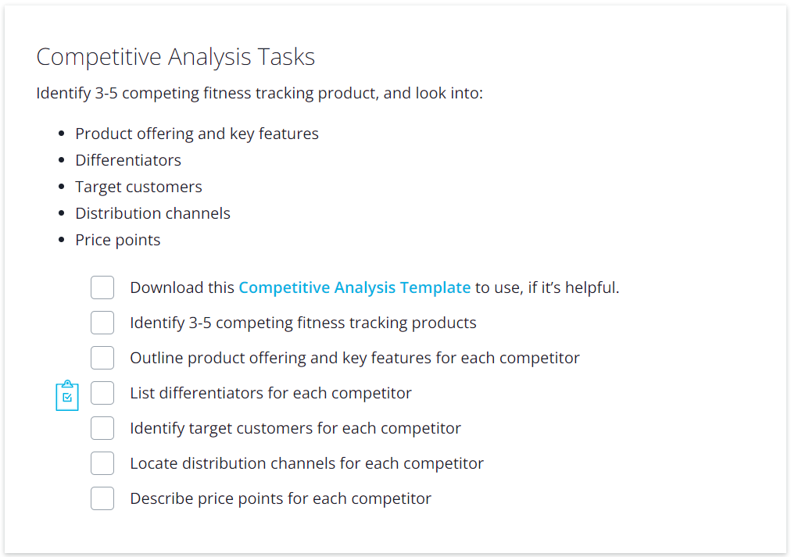

## 11. Solution: Competitive Analysis

An example of a competitive analysis for fitness tracking products

**Competitive Analysis**

Three competitors:

-   Apple Watch

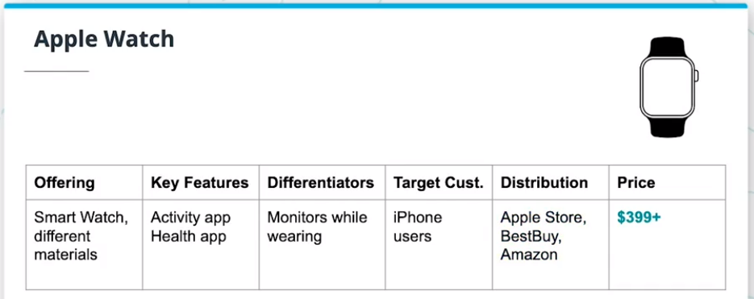

-   Strava

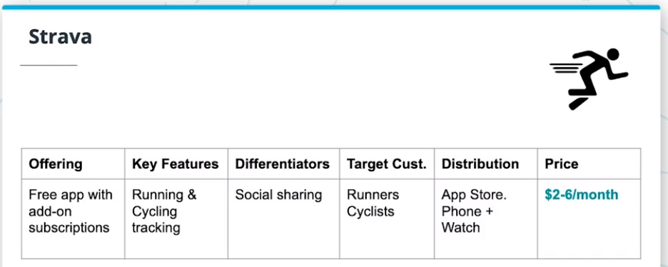

-   MyFitnessPal

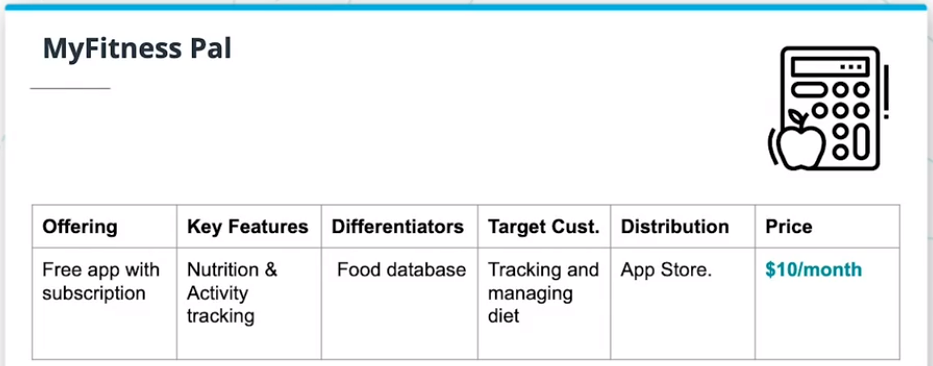

**Comparison**

## 12. MVP

> An **MVP**, or *minimum viable product*, has just enough features to
> get early adopters excited. After launching an MVP, you’ll get a lot
> of feedback that will help you understand if you have product market
> fit and what areas you should invest in next

WARNING! MVP does not mean the product should feel incomplete,
unfinished, or unpolished. On the contrary, it is essential to deliver a
high-quality experience to your users and investing good design and
reliability.

The MVP is a starting point for your product to grow into something
more. If you do not start on sound footing, users will abandon it before
you have the chance to build out more functionality.

### 12.1. Benefits of MVPs

-   Get product to market fast;
-   Get feedback from real users, and;
-   Fail Fast.

### 12.2. Creating an MVP

To create an MVP:

-   Start with the business model canvas
-   Weigh against competing solutions
-   Make sure it’s aligned with business objectives
-   Translate to requirements
-   Identify KPIs

By definition, an MVP is only **must have** features.

What are the goals of building an MVP?

-   Deliver customer value;
-   Get to market fast, and;
-   Get early feedback from customers.

The MVP allow you to get product to market fast, get feedback from real
users, and learn/fail fast.

## 13. KPI’s

## 14. Exercise: KPI’s

## 15. Solution: KPI’s

## 16. Lesson Recap

## 17. Glossary

|                  Term                  | Definition                                                                                                                                                                             |
|:--------------------------------------:|----------------------------------------------------------------------------------------------------------------------------------------------------------------------------------------|
|                  CPC                   | Cost per click.                                                                                                                                                                        |
|                  CPM                   | Cost per 1000 impressions.                                                                                                                                                             |
|                  CTR                   | Click through rate.                                                                                                                                                                    |
|                Freemium                | A revenue model that gives a small part of your product away at no cost to users with the ultimate goal of converting users to paid users in order to gain access to the full product. |
|               Licensing                | A revenue model that generates transaction based revenue. Users purchase a one time license to use your software on an ongoing basis.                                                  |
| KPI   (*Key Performance Indicator*) | KPIs can be used to measure the success of the products.                                                                                                                               |
|  MVP   (*Minimum Viable Product*)   | An early version of your product with minimal features that you can take to market in order to get feedback.                                                                           |
|              Pay per use               | A revenue model that generates transaction based revenue. Users pay a fee every time they use your product.                                                                            |
|             Revenue stream             | A source of revenue for a company, mostly commonly transaction based or recurring events.                                                                                              |
|              Subscription              | A type of revenue model that generates recurring revenue. Users pay a fee on an ongoing basis in exchange for access to your product.                                                  |
