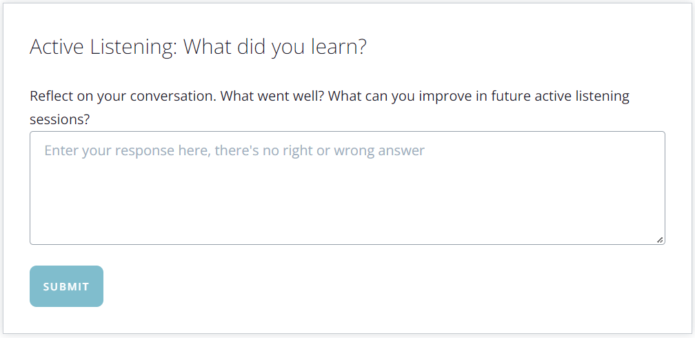
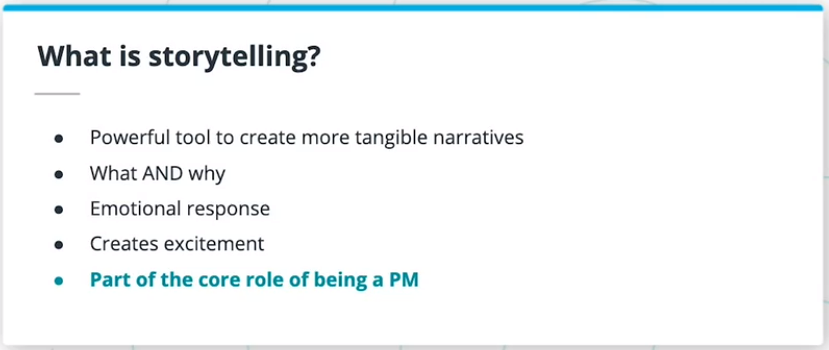
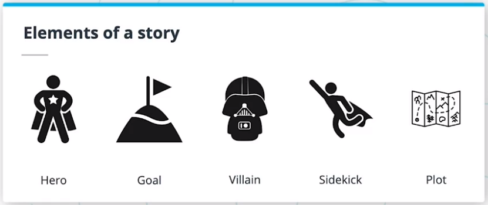
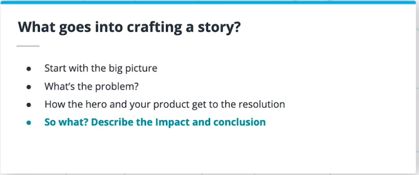
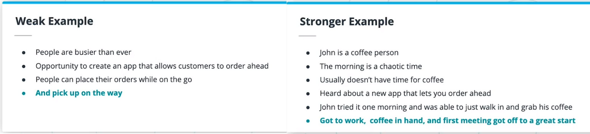
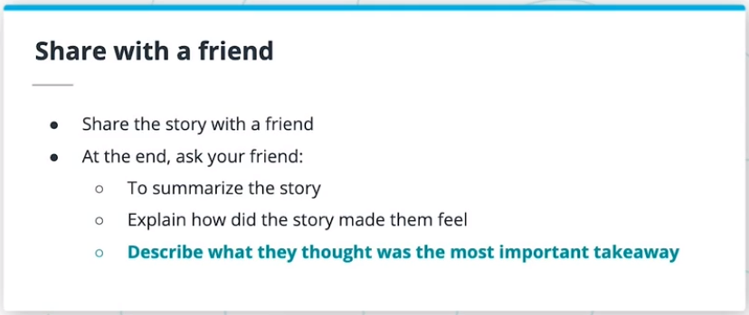

* Date:
  * From: 2022/10/13
  * To: 2022/10/13
* Course: Product Manager Nanodegree
    * Instructor: Alex King
    * COD: ND036

--------------------------------------------------------------------------------

## 1. Lesson Intro

In this lesson, we’ll cover the following topics:

* Active Listening
* Story telling
* Being Persuasive
* Presentations
* Negotiation

### 1.1. Learning Objectives

* Use active listening
* Craft and deliver compelling stories
* Be persuasive
* Create presentations
* Negotiate

## 2. Listening

Listening is important! You need to listen in order to **understand other perspectives and needs**. Listening also builds relationships, promotes understanding, and builds empathy. Additionally, it also helps to save time and make sure things are done right the first time

### 2.1. Active listening

Active listening is:

* More than just listening
* Being an engaged listener
* Fully understanding other points of views
* Not imposing your own views

### 2.2. Tips for active listening

* Make eye contact and smile
* Provide encouragement
* Don’t interrupt
* Ask clarifying questions when needed
* Paraphrase

**Further Research**

Active listening is a skill that most of us need to work on to develop. This can help:

* [How to Practice Active Listening](./Data/Active Listening_ Techniques, Benefits, Examples.pdf)

## 3. Exercise: Listening

Identify 2 friends or colleagues that you could have a short 15 minute conversation with. Pick a topic and really try to understand their point of view on it. Practice your active listening skills to see if you can understand their perspective as if it were your own

## 4. Storytelling

### 4.1. Product Managers are Storytellers

* Powerful tool to create more tangible narratives;
    * Stories allow you to express your vision and thoughts through more compelling, tangible narratives.
    * Storytelling makes it easier for people to understand and relate to what you are explaining.
* What AND Why
    * Explain both what is happening and why it is happening
* Emotional response
    * Create an emotional response that gets the audience invested in the outcome
* Creates Excitement
    * Get people excited about solving the problem
* Part of the core role of begin a PM
    * Explaining the roadmap to the leader
    * Building user stories for the design and engineering team

### 4.2. Story Elements

|Elements|Description|
|:--:|:-------|
|**Hero (your user)**|who they are, what they care about, and their background|
|**Goal**|what the hero is trying to accomplish|
|**Villain (the problem)**|whatever is preventing the hero from reaching their goal|
|**Sidekick (your product)**|something that will help the Hero reach their goal|
|**Plot**|describes how the Hero and Sidekick defeat the Villain and achieve their goal|

### 4.3. Crafting a Story

1. Start with the big picture to provide context (who your audience is and what they care about)
2. Describe the problem or conflict (the problem your product solves)
3. Outline the plot for getting to resolution (how your product solves the problem and why it is better than other solutions)
4. Describe the impact and conclusion (why it matters that the problem was solved)

### 4.4. Storytelling Tips

* Keep the story simple
    * The simpler your message is, the more that it will get across to your audience.
    * After creating the story, ask yourself how you would tell the same story in half of the needed time.
* Make it memorable by including emotional moments
    * Your story must be memorable, and people should be able to remember the important parts of your story.
    * Make it personal and related to the persons who might have experienced themselves
* Show instead of telling
    * Craft an MVP, POC, Mocks or Demos.
* Practice! Practice! Practice! until you can tell the story without referring to notes

### 4.5. Storytelling Examples

Key things to keep in mind when building stories:

* Focus on the problem from the hero’s perspective
* Start by writing the ending first
* The more personal and relatable the story, the more memorable it will be, and the more engaged the audience will be.
* Details and specifics make the story feel more real

**Further Research**

* [Storytelling that Moves People](./Data/Storytelling That Moves People.pdf)
* [How Pixar’s 22 Storytelling Rules Apply to Your Business](./Data/How Pixar’s 22 Storytelling Rules Apply to Your Business.pdf)

## 5. Exercise: Storytelling

### Step 1: Create a story about why you are taking this course

* Why are you taking this course?
* What you are hoping to get out of it?
* What are some of the challenges you might encounter?
* Where do you see yourself one year after completing this course?

### Step 2: Practice!

Practicing a story is critical! Rehearse your story, out loud, in front of a mirror.

### Step 3: Share with a friend!

Tell your friend your story and then ask your friend to:

* Summarize the story
* Explain how the story made them feel
* Describe what they thought was the most important takeaway

## 6. Persuasive Messages

**Further Research**

Want to be more persuasive? Read these:

* [The Science of Persuasion](./Data/)
* [Want to Be Extremely Persuasive? 9 Science-Backed Ways to Become a Better Leader](./Data/)
* [21 Principles of Persuasion](./Data/)

## 7. Presentations

## 8. Exercise: Presentations

## 9. Negotiation

## 10. Exercise: Negotiation

## 11. Lesson Recap
