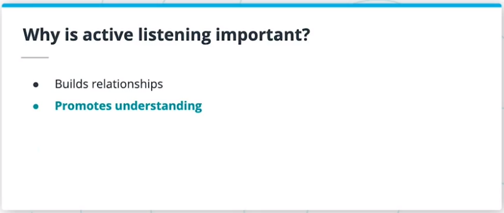

* Date:
  * From: 2022/10/13
  * To: 2022/10/14
* Course: Product Manager Nanodegree
    * Instructor: Alex King
    * COD: ND036

--------------------------------------------------------------------------------

## 1. Lesson Intro

In this lesson, we’ll cover the following topics:

* Active Listening
* Story telling
* Being Persuasive
* Presentations
* Negotiation

### 1.1. Learning Objectives

* Use active listening
* Craft and deliver compelling stories
* Be persuasive
* Create presentations
* Negotiate

## 2. Listening

Listening is important! You need to listen in order to **understand other perspectives and needs**. Listening also builds relationships, promotes understanding, and builds empathy. Additionally, it also helps to save time and make sure things are done right the first time

### 2.1. Active listening

Active listening is:

* More than just listening
* Being an engaged listener
* Fully understanding other points of views
* Not imposing your own views

### 2.2. Tips for active listening

* Make eye contact and smile
* Provide encouragement
* Don’t interrupt
* Ask clarifying questions when needed
* Paraphrase

**Further Research**

Active listening is a skill that most of us need to work on to develop. This can help:

* [How to Practice Active Listening](./Data/Active Listening_ Techniques, Benefits, Examples.pdf)

## 3. Exercise: Listening

Identify 2 friends or colleagues that you could have a short 15 minute conversation with. Pick a topic and really try to understand their point of view on it. Practice your active listening skills to see if you can understand their perspective as if it were your own

## 4. Storytelling

### 4.1. Product Managers are Storytellers

* Powerful tool to create more tangible narratives;
    * Stories allow you to express your vision and thoughts through more compelling, tangible narratives.
    * Storytelling makes it easier for people to understand and relate to what you are explaining.
* What AND Why
    * Explain both what is happening and why it is happening
* Emotional response
    * Create an emotional response that gets the audience invested in the outcome
* Creates Excitement
    * Get people excited about solving the problem
* Part of the core role of begin a PM
    * Explaining the roadmap to the leader
    * Building user stories for the design and engineering team

### 4.2. Story Elements

|Elements|Description|
|:--:|:-------|
|**Hero (your user)**|who they are, what they care about, and their background|
|**Goal**|what the hero is trying to accomplish|
|**Villain (the problem)**|whatever is preventing the hero from reaching their goal|
|**Sidekick (your product)**|something that will help the Hero reach their goal|
|**Plot**|describes how the Hero and Sidekick defeat the Villain and achieve their goal|

### 4.3. Crafting a Story

1. Start with the big picture to provide context (who your audience is and what they care about)
2. Describe the problem or conflict (the problem your product solves)
3. Outline the plot for getting to resolution (how your product solves the problem and why it is better than other solutions)
4. Describe the impact and conclusion (why it matters that the problem was solved)

### 4.4. Storytelling Tips

* Keep the story simple
    * The simpler your message is, the more that it will get across to your audience.
    * After creating the story, ask yourself how you would tell the same story in half of the needed time.
* Make it memorable by including emotional moments
    * Your story must be memorable, and people should be able to remember the important parts of your story.
    * Make it personal and related to the persons who might have experienced themselves
* Show instead of telling
    * Craft an MVP, POC, Mocks or Demos.
* Practice! Practice! Practice! until you can tell the story without referring to notes

### 4.5. Storytelling Examples

Key things to keep in mind when building stories:

* Focus on the problem from the hero’s perspective
* Start by writing the ending first
* The more personal and relatable the story, the more memorable it will be, and the more engaged the audience will be.
* Details and specifics make the story feel more real

**Further Research**

* [Storytelling that Moves People](./Data/Storytelling That Moves People.pdf)
* [How Pixar’s 22 Storytelling Rules Apply to Your Business](./Data/How Pixar’s 22 Storytelling Rules Apply to Your Business.pdf)

## 5. Exercise: Storytelling

### Step 1: Create a story about why you are taking this course

* Why are you taking this course?
* What you are hoping to get out of it?
* What are some of the challenges you might encounter?
* Where do you see yourself one year after completing this course?

### Step 2: Practice!

Practicing a story is critical! Rehearse your story, out loud, in front of a mirror.

### Step 3: Share with a friend!

Tell your friend your story and then ask your friend to:

* Summarize the story
* Explain how the story made them feel
* Describe what they thought was the most important takeaway

## 6. Persuasive Messages

### 6.1. Why Does Persuasion Matter?

Persuasion is important because you work with lots of people and need to align the team needs to be aligned -- but you don’t have direct authority over everyone. Instead, **you have to convince them!**

### 6.2. Types of Persuasion

There are 3 (three) differents modes of persuasion according to Aristotle.

The team will trust you if your messages use:

|Types of Persuasion|Description|
|:-:|:-----------------|
|Ethos (credibility)|you are qualified to speak on the topic due to your experiences, personal character, background, and achievements.|
|Pathos (emotion)|you can make your audience feel a certain way|
|Logos (logic)|you build an argument based on logic and facts|

The most persuasive messages use all three types of persuasion.

### 6.3. How to Build Persuasive Messages:

* Know your audience and know what they care about.
    * It will allow you to tailor your message to specifically address those concerns.
* Pick a viewpoint
    * Be decisive
    * Explain why it is the best outcome.
* Know the other perspectives
    * Including the pros and cons of each.
* Be data-driven (support you claims with data)
* Discuss objections
    * It is important to discuss objections.
    * Have a real discussion around the merits of those other viewpoints and try to get the group to a consensus on them.
* End with a call to action
    * Outline the next steps.

**Further Research**

Want to be more persuasive? Read these:

* [The Science of Persuasion](./Data/The Science of Persuasion_ How to Get People to Agree With What You Say.pdf)
* [Want to Be Extremely Persuasive? 9 Science-Backed Ways to Become a Better Leader](./Data/Want to Be Extremely Persuasive_ 9 Science-Backed Ways to Become a Better Leader _ Inc.com.pdf)
* [21 Principles of Persuasion](./Data/The 21 Principles of Persuasion.pdf)

## 7. Presentations

Presentations:

* Keep it simple;
* Do not try to cover everything;
    * Just focus on getting your keys points and messages across.

As a PM, you will need to be constantly communicating and presentations are a great tool to share your ideas. But it’s important to learn how to create presentations that can effectively communicate your message.

### 7.1. Presentation Structure

* Introduction: “This is what I’m going to tell you” and background info
* Body: “This is what we’re here to talk about”
* Conclusion: “This is what I just told you” and next steps

### 7.2. Slide Layout

* Keep slides simple
* One takeaway per slide
* Limit the amount of text on each slide (no paragraphs)
* Use visuals carefully

### 7.3. Tips when creating a presentation

* Presentation needs to stand on its own
* Rehearse
* Pre-brief key stakeholders before big presentations

**Further Research**

* [19 Great Examples of PowerPoint Presentation Design](./Data/20 Great Examples of PowerPoint Presentation Design.pdf)
* [Quite Possibly the World’s Worst PowerPoint Presentation Ever](./Data/worst-powerpoint-ever.pdf)
* [Bad PowerPoint Examples You Should Avoid at All Costs](./Data/Bad PowerPoint Examples You Should Avoid at All Costs.pdf)

## 8. Exercise: Presentations

This exercise has three steps:

#### Step 1: Create a presentation

Your topic is: Why you should avoid using your smartphone before bed and it should include at least 10 slides.

As you craft your presentation, focus on:

* What are the key takeaways?
* What visuals can you use to support your presentation?

#### Step 2: Practice!

Just like with storytelling, practicing a presentation is critical! Rehearse it out loud and pay attention to slide transitions.

#### Step 3: Present to a friend!

Give the presentation to your friend and then ask your friend to share feedback:

* Were there any parts that were confusing?
* What was the most important takeaway?

## 9. Negotiation

### 9.1. PMs Use Negotiation Every Day!

* Negotiation is all about trying to reach an agreement when there is conflict.
    * As a PM, you will be negotiating every day, whether it’s about what the product should do, who’s going to be working on the product, or timelines.
* Compromise to find the **best mutual outcome** for all parties involved.

### 9.2. Negotiation Styles

|Style|Description|
|:--:|:-----------|
|Competitive|Getting exactly what I want|
|Collaborative|Working together to find a solution where everyone is happy|
|Compromise|Giving up some things in order to get some things in return|
|Avoidance|Not comfortable in situations where there’s conflict (both lose because the issues end up not being directly discussed).|
|Accommodation|Agreeing to something in order to preserve a relationship, even though it’s not in my best interest|

In most cases a **Collaborative** style is the **best approach**.

### 9.3. Strategies for Negotiation

|Strategies|Description|
|:----:|:-----------|
|**BATNA (Best Alternative To a Negotiated Agreement)**|Understanding each side’s best alternative to a negotiated agreement will help you focus on what happens if you can’t reach an agreement -- and that can give you leverage to get to an agreement.|
|**Focus on interests**|It’s helpful to understand what each side is interested in and why so understand where to focus during negotiation.|
|**Make the pie bigger**|Based on understanding the other side’s interests, are there any things that you can offer that will be valuable for them that won’t cost you anything or be difficult for you to give away?|
|**Use objective criteria**|Using objective criteria bases the conversation in reality and helps remove emotion.|
|**Present multiple solutions**|Multiple solutions help you get more information because you receive feedback about how the other side feels about each option.|

### 9.4. Tips for negotiating:

|Tips|Description|
|:--:|:-----------|
|Build strong relationships|• Relationships matter a lot. It's easier to negotiate due to the level of truth in each other.|
|Use active listening|• You must understand the other side's point of view and why they have that point of view.|
|Keep emotions in check|• Stay calm and relaxed|
|Work together to find a solution|• Involve the other side in finding a solution. • Align the goals to work towards the same purpose.|

**Further Research**

* [Negotiation Skills for Product Managers: 5 Things You Need to Know](./Data/Negotiation Skills for Product Managers_ 5 Things You Need to Know _ by Brent Tworetzky _ Agile Insider _ Medium.pdf)
* [5 Highly Effective Negotiation Tactics Anyone Can Use](./Data/5 Highly Effective Negotiation Tactics Anyone Can Use _ Inc.com.pdf)
* [4 Ways to Practice Your Negotiation Skills](./Data/Use It Or Lose It_ 4 Ways to Practice Your Negotiation Skills.pdf)

## 10. Exercise: Negotiation

For each of the scenarios listed below, think about how you would negotiate and which strategies you would use.

### 10.1. Negotiations 1

You just finished presenting your roadmap for next year. The Engineering VP has a lot of feedback that the plan doesn’t make sense given the current state of the product. What do you do?

### 10.2. Negotiations 2

Engineers have been ready to start working on a new feature for your product. However, the UX designs aren’t finalized and the designer wants to spend more time revising and iterating. However, both you and the engineers think that the designs look fine. What do you do?

### 10.3. Negotiations 3

You and a counterpart PM both have a large P0 feature that needs to be delivered. However, between the two of you and your teams you’ll only be able to deliver 1 of the 2 P0 features-- the feature on your roadmap or the feature on your counterpart’s roadmap. What do you do?

## 11. Lesson Recap

You’ve reached the end of the Problem Identification lesson. We covered the following topics:

* Active Listening
* Story telling
* Being Persuasive
* Presentations
* Negotiation

You’ve also reached the end of this course. Now that you’ve completed this course, you should be able to:

* Describe the role of a PM and a PM’s critical partners
* Build roadmaps and write PRDs
* Identify and size opportunities
* Create a business case for a new product opportunity
* Define the use cases of a product, including its KPIs
* Build a business model for your new product
* Put together and present a compelling product pitch to gain internal stakeholder buy-in

## 12. Glossary

|Term|Definition|
|:-:|:------|
|Ethos|The Greek word for character, describing the credibility of an individual|
|Logos|The Greek word for reason or logic|
|Pathos|The Greek word for emotion|
|BATNA|Best Alternative To a Negotiated Agreement. If negotiations were to fail, BATNA is the next best option|
